## 秒杀设计  

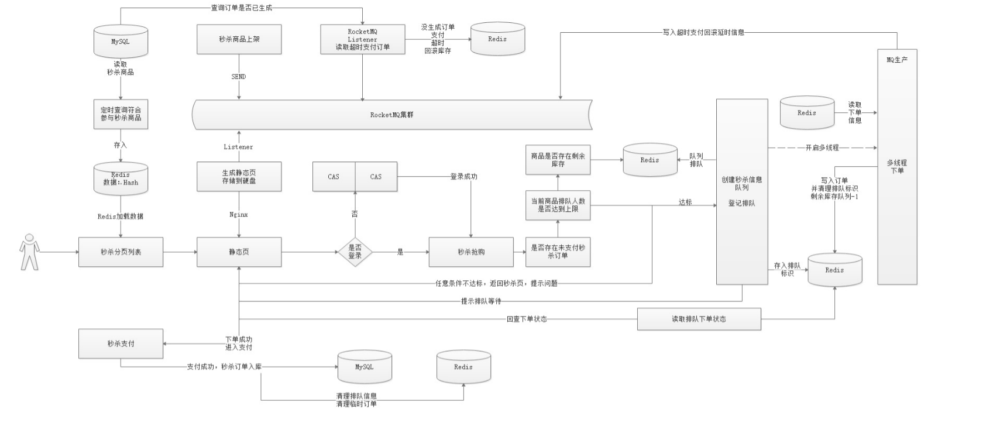   
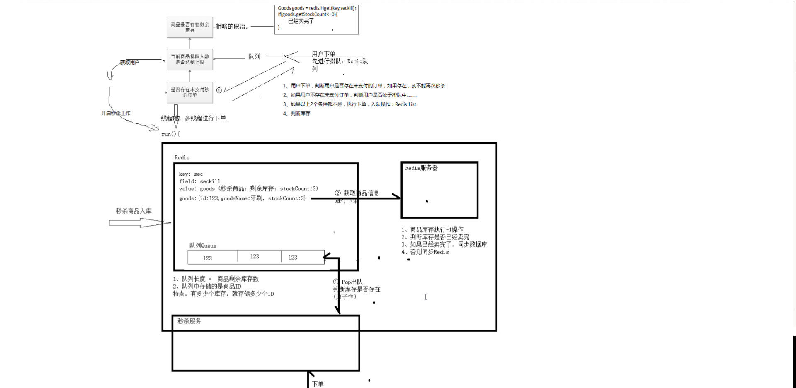   

### 秒杀问题思考  
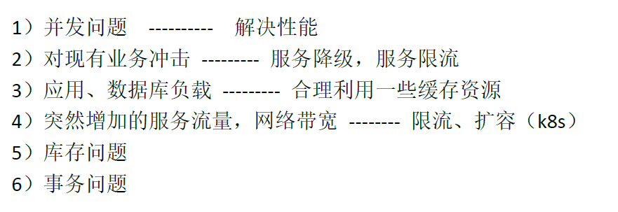 
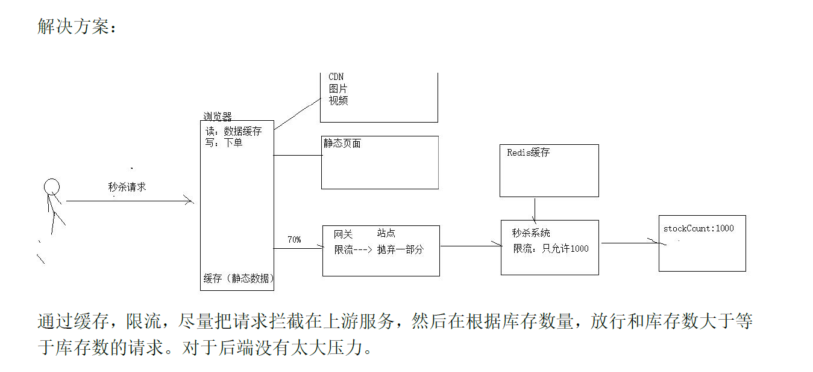   
DB设计思路  
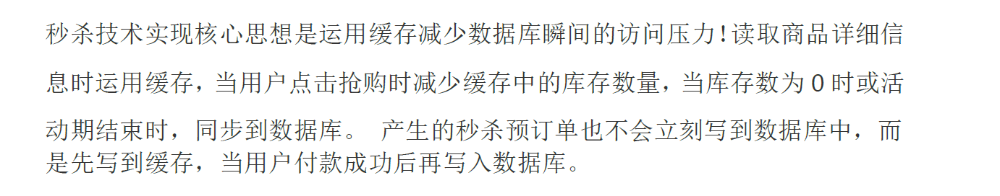   
商品入库到Redis如何存储  
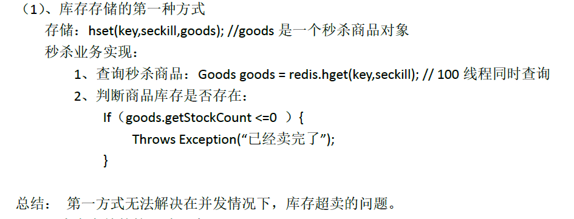
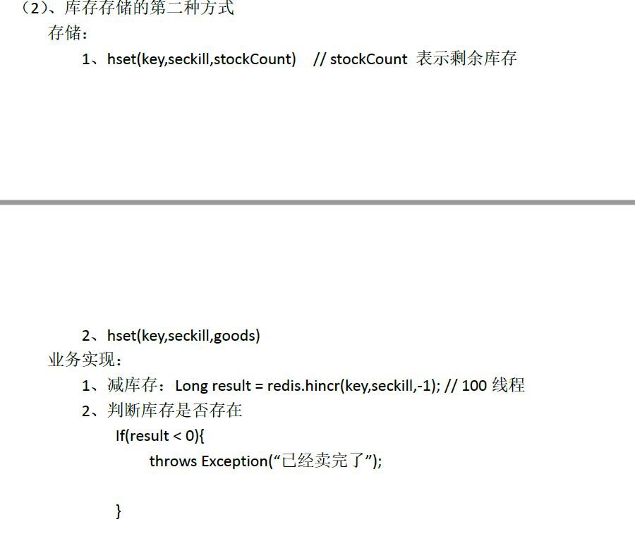
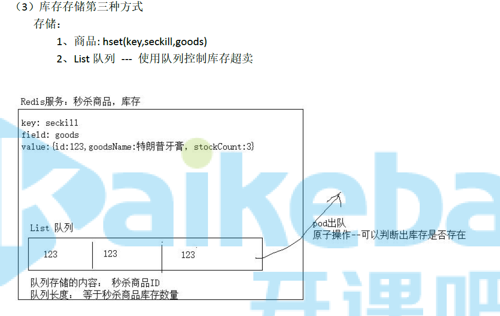   
秒杀下单，多线程     
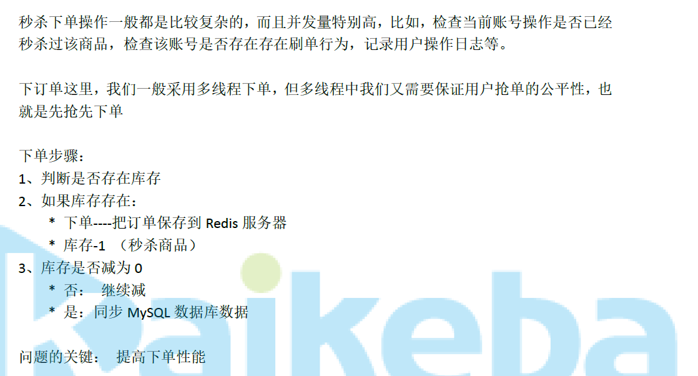   
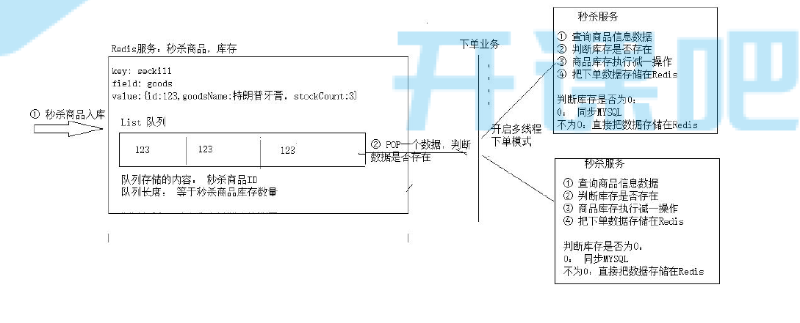   

事务处理方式：  
1. 业务补偿机制  
2. redis异步捕获  
3. 人肉混滚  

参考： https://www.cnblogs.com/wyq178/p/11261711.html  
秒杀设计与技术方案  
* 接口限流： 
** 前端限流:  
  首先第一步就是通过前端限流，用户在秒杀按钮点击以后发起请求，
  那么在接下来的5秒是无法点击(通过设置按钮为disable)。这一小举措开发起来成本很小，但是很有效  
  
** 同一个用户xx秒内重复请求直接拒绝:  
  具体多少秒需要根据实际业务和秒杀的人数而定，一般限定为10秒。
  具体的做法就是通过redis的键过期策略，首先对每个请求都从String value = redis.get(userId);
  如果获取到这个.

  value为空或者为null，表示它是有效的请求，然后放行这个请求。
  如果不为空表示它是重复性请求，直接丢掉这个请求。
  如果有效,采用redis.setexpire(userId,value,10). value可以是任意值，
  一般放业务属性比较好,这个是设置以userId为key，10秒的过期时间(10秒后,key对应的值自动为null)  

** 后端限流:    
  1). guava的 RateLimiter令牌桶  
  2). JUC的 Semaphore计数信号量  
策略:如果超过某个时间没有获取到，直接拒绝该任务。  
```java
public class TestRateLimiter2 {

    public static void main(String[] args) {
        final RateLimiter rateLimiter = RateLimiter.create(1);

        for (int i = 0; i < 10; i++) {
            long timeOut = (long) 0.5;
            boolean isValid = rateLimiter.tryAcquire(timeOut, TimeUnit.SECONDS);
            System.out.println("任务" + i + "执行是否有效:" + isValid);
            if (!isValid) {
                continue;
            }
            System.out.println("任务" + i + "在执行");
        }
        System.out.println("结束");
    }
}
```     
其中用到了tryAcquire方法，这个方法的主要作用是设定一个超时的时间，
如果在指定的时间内预估(注意是预估并不会真实的等待)，如果能拿到令牌就返回true，
如果拿不到就返回false.然后我们让无效的直接跳过，这里设定每秒生产1个令牌，让每个任务尝试在
0.5秒获取令牌，如果获取不到,就直接跳过这个任务  
只有第1个获取到了令牌，顺利执行了，下面的基本都直接抛弃了，因为0.5秒内，令牌桶(1秒1个)来不及生产就肯定获取不到返回false了。

- 这个限流策略的效率有多高呢？  
假如我们的并发请求是400万瞬间的请求,将令牌产生的效率设为每秒20个，
  每次尝试获取令牌的时间是0.05秒，那么最终测试下来的结果是，
  每次只会放行4个左右的请求,大量的请求会被拒绝,这就是令牌桶算法的优秀之处。  
  
* 异步下单  
  为了提升下单的效率，并且防止下单服务的失败。需要将下单这一操作进行异步处理。  
  最常采用的办法是使用队列，队列最显著的三个优点：异步、削峰、解耦。  
  这里可以采用rabbitmq，在后台经过了限流、库存校验之后，流入到这一步骤的就是有效请求。  
  然后发送到队列里，队列接受消息，异步下单。  
  下完单，入库没有问题可以用短信通知用户秒杀成功。假如失败的话,可以采用补偿机制，重试。  

* 服务降级  
  假如在秒杀过程中出现了某个服务器宕机，或者服务不可用，应该做好后备工作。
  之前的博客里有介绍通过Hystrix进行服务熔断和降级，
  可以开发一个备用服务，假如服务器真的宕机了，直接给用户一个友好的提示返回，
  而不是直接卡死，服务器错误等生硬的反馈。  
  
*  秒杀url的设计
   为了避免有程序访问经验的人通过下单页面url直接访问后台接口来秒杀货品，
   我们需要将秒杀的url实现动态化，即使是开发整个系统的人都无法在秒杀开始前知道秒杀的url。
   具体的做法就是通过md5加密一串随机字符作为秒杀的url，然后前端访问后台获取具体的url，
   后台校验通过之后才可以继续秒杀。  
   
* 秒杀页面静态化  
  将商品的描述、参数、成交记录、图像、评价等全部写入到一个静态页面，用户请求不需要通过访问后端服务器，不需要经过数据库，
  直接在前台客户端生成，这样可以最大可能的减少服务器的压力。
  具体的方法可以使用freemarker模板技术，建立网页模板，填充数据，然后渲染网页  
  
* 单体redis升级为集群redis  
  秒杀是一个读多写少的场景，使用redis做缓存再合适不过。
  不过考虑到缓存击穿问题，我们应该构建redis集群，采用哨兵模式，可以提升redis的性能和可用性。

* 使用nginx  
  nginx是一个高性能web服务器，它的并发能力可以达到几万，而tomcat只有几百。
  通过nginx映射客户端请求，再分发到后台tomcat服务器集群中可以大大提升并发能力。  
  
* 精简sql  
  典型的一个场景是在进行扣减库存的时候，传统的做法是先查询库存，再去update。
  这样的话需要两个sql，而实际上一个sql我们就可以完成的。
  可以用这样的做法：update miaosha_goods  set stock =stock-1 where goos_id ={#goods_id} and  version = #{version} and sock>0;
  这样的话，就可以保证库存不会超卖并且一次更新库存,还有注意一点这里使用了版本号的乐观锁，相比较悲观锁，它的性能较好。

* redis预减库存  
  很多请求进来，都需要后台查询库存,这是一个频繁读的场景。
  可以使用redis来预减库存，在秒杀开始前可以在redis设值，
  比如redis.set(goodsId,100),这里预放的库存为100可以设值为常量),
  每次下单成功之后,Integer stock = (Integer)redis.get(goosId); 
  然后判断sock的值，如果小于常量值就减去1;不过注意当取消的时候,
  需要增加库存，增加库存的时候也得注意不能大于之间设定的总库存数
  (查询库存和扣减库存需要原子操作，此时可以借助lua脚本)
  下次下单再获取库存的时候,直接从redis里面查就可以了。

* 总结  
  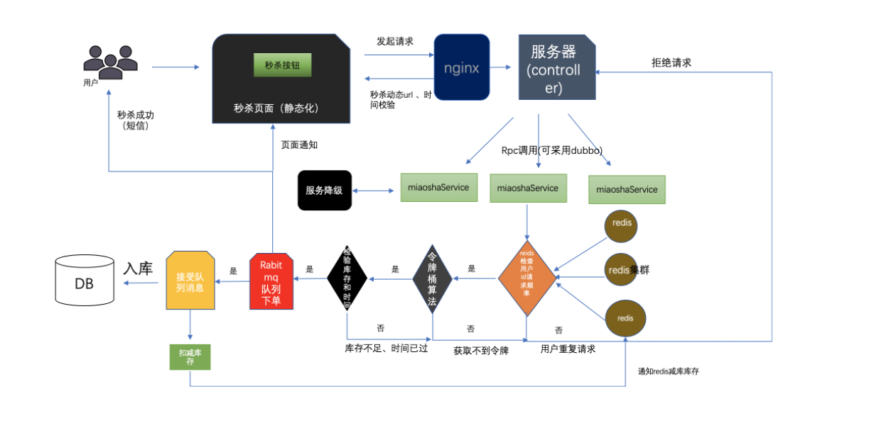   