## 方法区

   
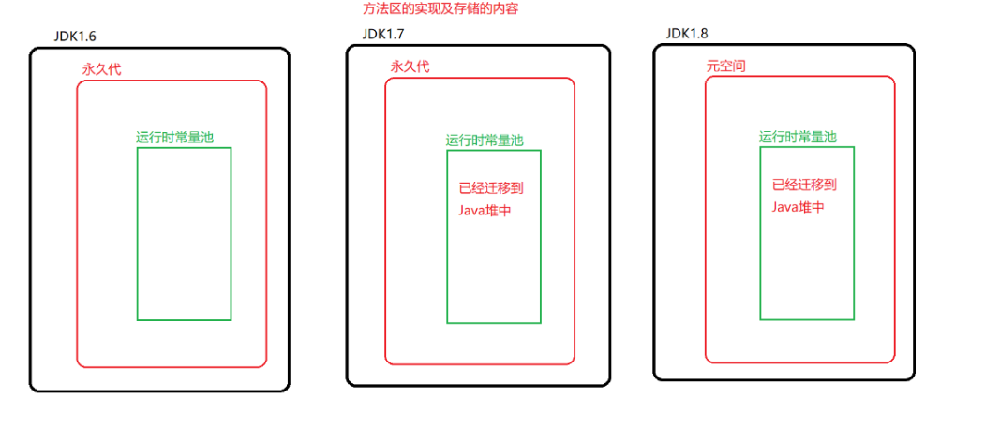   
运行时常量池+字符串常量池  
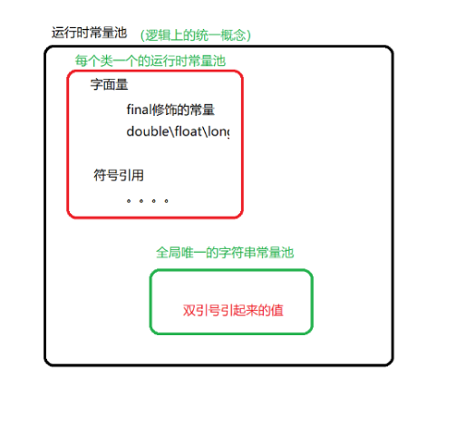   
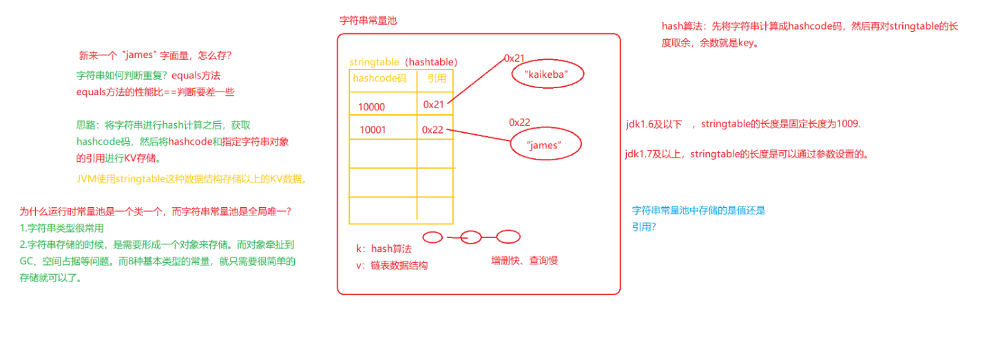   
   
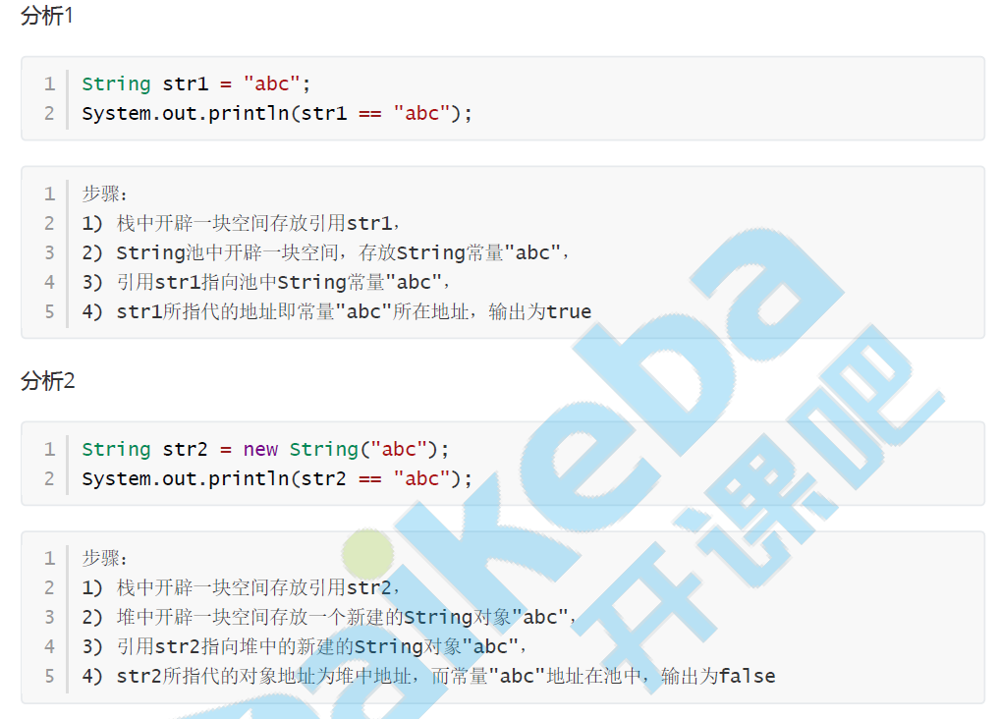   
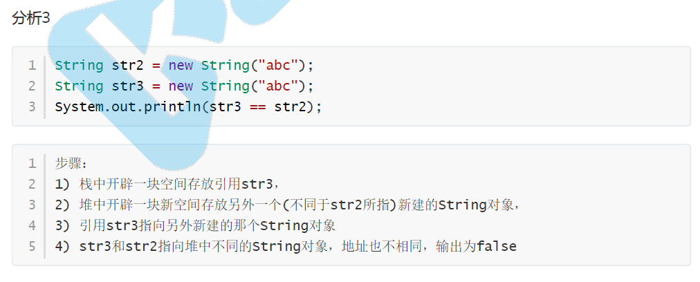   
   
   
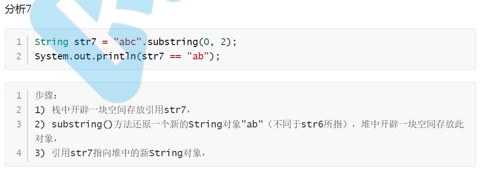   
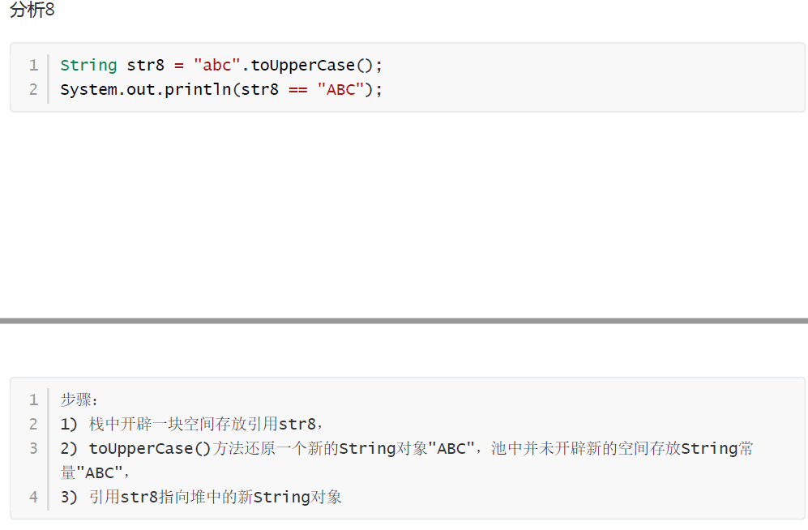   
intern  
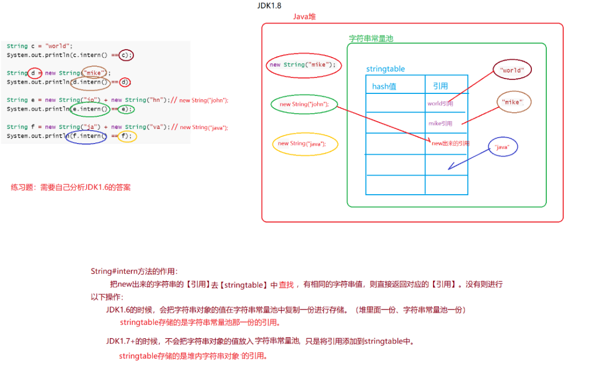   
运行时数据区  
   
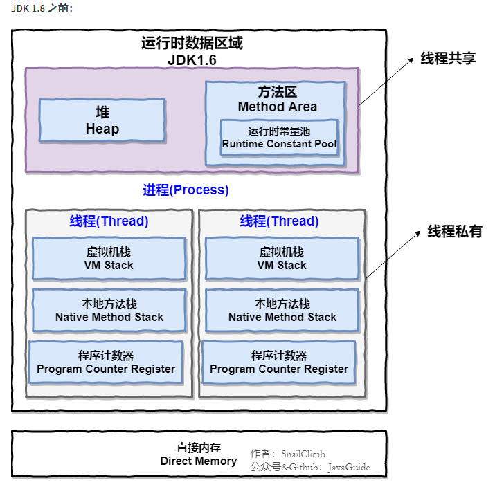   
   
堆  
   
-----------------------------------------------------------  
一、对象的创建  
   
* step1: 类加载检查  
虚拟机遇到一条new指令时，首先去检查这个指令的参数是否能在常量池中定位到这个类的符号引用，并且检查这个符号引用代表的类是否已经被加载过、解析和初始化过。
  如果没有，那必须先执行相应的类加载过程。  
* step2: 分配内存  
在类加载检查通过后，接下来虚拟机将为新生对象分配内存。对象所需的内存大小在类加载完毕后便可确定，为对象分配空间的任务等同于把一块确定大小的内存从java堆中
  划分出来。分配方式有“指针碰撞”和“空闲列表”两种，选择哪种分配方式由java堆是否规整决定，而java堆是否规整又由所采用的的垃圾收集器是否带有压缩整理功能决定。  
    
内存分配的两种方法：  
选择哪种方法取决于Java堆内存是否规整。而java堆内存是否规整，取决于GC收集器的算法是“标记-清除”，还是“标记-整理”，值得注意的是，复制算法内存也是规整的。  
   
内存分配并发问题：  
1. CAS+失败重试： CAS 是乐观锁的一种实现方式。所谓乐观锁就是，每次不加锁而是假设没有冲突而去完成某项操作，如果因为冲突失败就重试，直到成功为止。虚拟机采用 CAS 配上失败重试的方式保证更新操作的原子性。  
2. TLAB： 为每一个线程预先在 Eden 区分配一块儿内存，JVM 在给线程中的对象分配内存时，首先在 TLAB 分配，当对象大于 TLAB 中的剩余内存或 TLAB 的内存已用尽时，再采用上述的 CAS 进行内存分配。  

* step3: 初始化零值  
  内存分配完成后，虚拟机需要将分配到的内存空间都初始化为零值（不包括对象头），这一步操作保证了对象的实例字段在 Java 代码中可以不赋初始值就直接使用，程序能访问到这些字段的数据类型所对应的零值。  

* step4: 设置对象头  
  初始化零值完成之后，虚拟机要对对象进行必要的设置，例如这个对象是哪个类的实例、如何才能找到类的元数据信息、对象的哈希码、对象的 GC 分代年龄等信息。 这些信息存放在对象头中。 另外，根据虚拟机当前运行状态的不同，如是否启用偏向锁等，对象头会有不同的设置方式。  
  
* step5: 执行init方法  
  在上面工作都完成之后，从虚拟机的视角来看，一个新的对象已经产生了，但从 Java 程序的视角来看，对象创建才刚开始，<init> 方法还没有执行，所有的字段都还为零。所以一般来说，执行 new 指令之后会接着执行 <init> 方法，把对象按照程序员的意愿进行初始化，这样一个真正可用的对象才算完全产生出来。  
  
二、垃圾回收算法
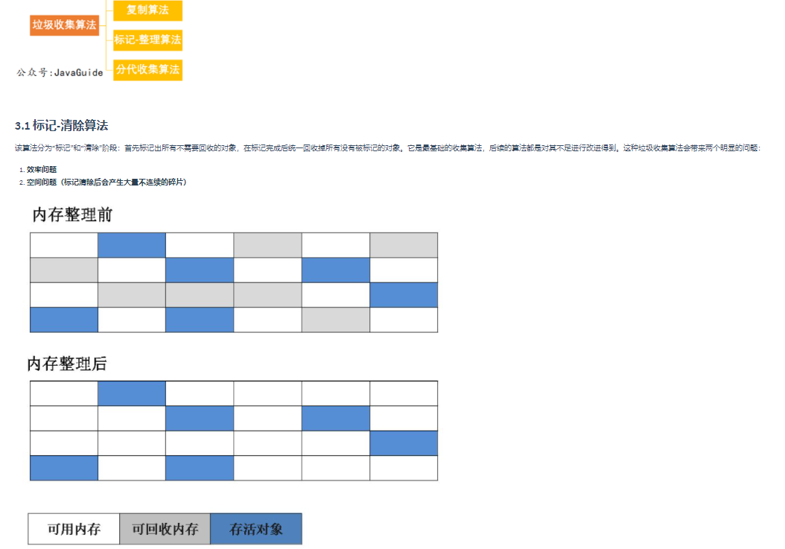  
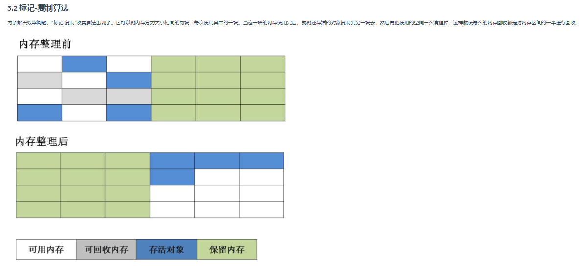  
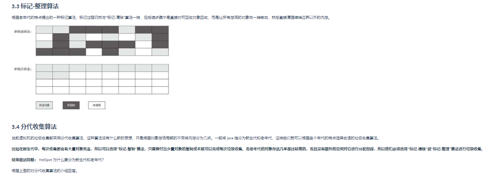  

