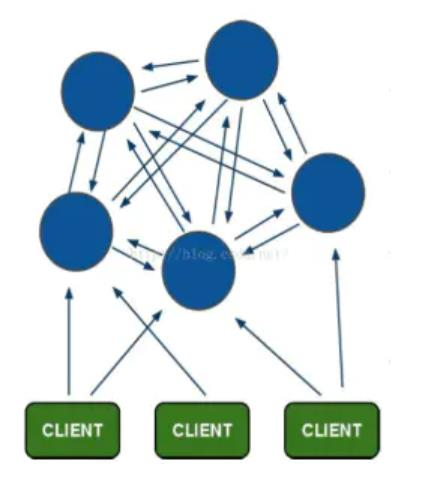
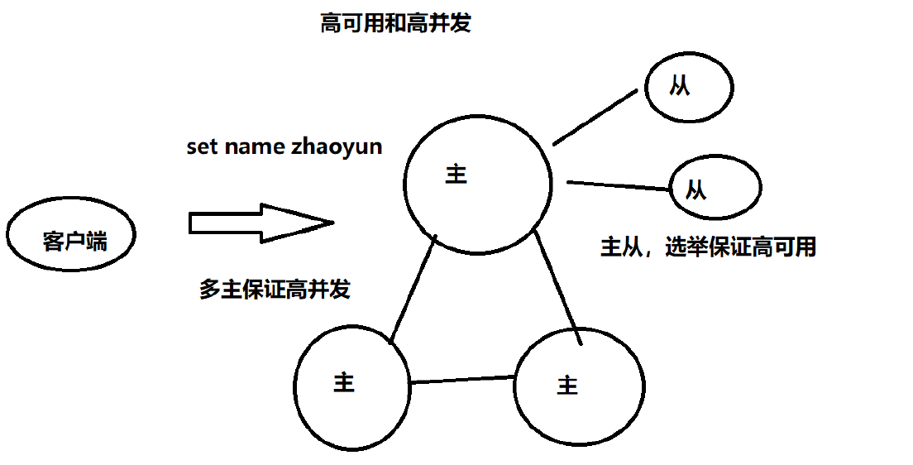
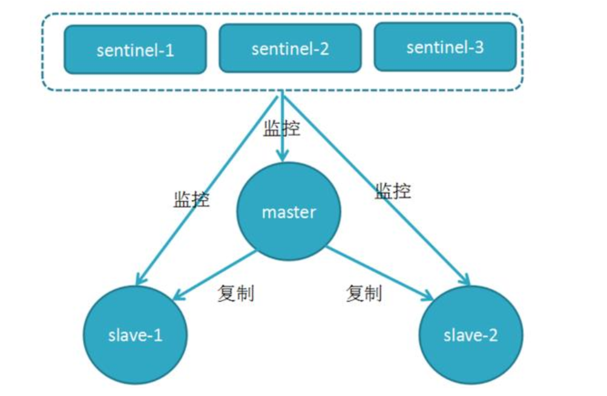
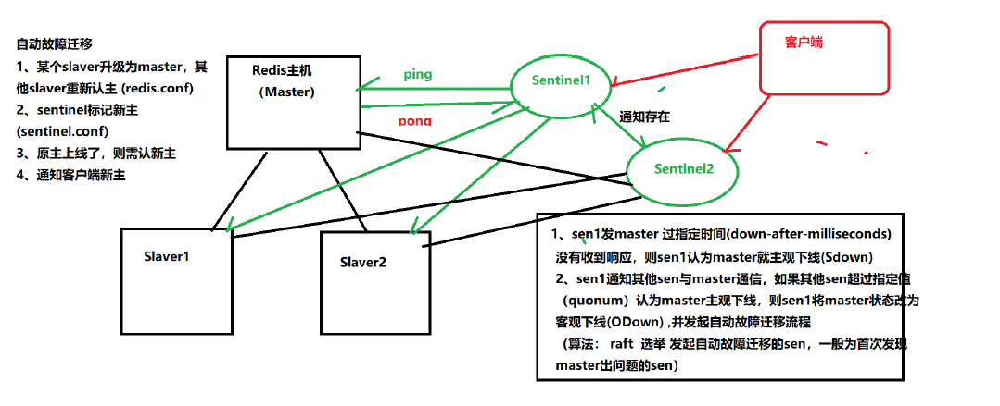

## Redis集群
一、cluster
Redis-Cluster采用无中心结构，每个节点保存数据和整个集群状态,每个节点都和其他所有节点连接。  
    
其结构特点：  
1、所有的redis节点彼此互联(PING-PONG机制),内部使用二进制协议优化传输速度和带宽。  
2、节点的fail是通过集群中超过半数的节点检测失效时才生效。  
3、客户端与redis节点直连,不需要中间proxy层.客户端不需要连接集群所有节点,连接集群中任何一个可用节点即可。  
4、redis-cluster把所有的物理节点映射到[0-16383]slot上（不一定是平均分配）,cluster 负责维护node<->slot<->value。  
5、Redis集群预分好16384个桶，当需要在 Redis 集群中放置一个 key-value 时，根据 CRC16(key) mod 16384的值，决定将一个key放到哪个桶中。  

a.redis cluster节点分配  
现在我们是三个主节点分别是：A, B, C 三个节点，它们可以是一台机器上的三个端口，也可以是三台不同的服务器。那么，采用哈希槽 (hash slot)的方式来分配16384个slot 的话，它们三个节点分别承担的slot 区间是：  

节点A覆盖0－5460;  

节点B覆盖5461－10922;  

节点C覆盖10923－16383.  

获取数据:  
如果存入一个值，按照redis cluster哈希槽的算法： CRC16('key')384 = 6782。  
那么就会把这个key 的存储分配到 B 上了。同样，当我连接(A,B,C)任何一个节点想获取'key'这个key时，也会这样的算法，然后内部跳转到B节点上获取数据

新增一个主节点:  
新增一个节点D，redis cluster的这种做法是从各个节点的前面各拿取一部分slot到D上，我会在接下来的实践中实验。大致就会变成这样：  

节点A覆盖1365-5460  

节点B覆盖6827-10922  

节点C覆盖12288-16383  

节点D覆盖0-1364,5461-6826,10923-12287  

同样删除一个节点也是类似，移动完成后就可以删除这个节点了。  

b.Redis Cluster主从模式  
redis cluster 为了保证数据的高可用性，加入了主从模式，一个主节点对应一个或多个从节点，  
主节点提供数据存取，从节点则是从主节点拉取数据备份，当这个主节点挂掉后，就会有这个从节点选取一个来充当主节点，从而保证集群不会挂掉  

上面那个例子里, 集群有ABC三个主节点, 如果这3个节点都没有加入从节点，如果B挂掉了，我们就无法访问整个集群了。A和C的slot也无法访问。   

所以我们在集群建立的时候，一定要为每个主节点都添加了从节点,   
比如像这样, 集群包含主节点A、B、C, 以及从节点A1、B1、C1, 那么即使B挂掉系统也可以继续正确工作。  

B1节点替代了B节点，所以Redis集群将会选择B1节点作为新的主节点，集群将会继续正确地提供服务。  
当B重新开启后，它就会变成B1的从节点。  

不过需要注意，如果节点B和B1同时挂了，Redis集群就无法继续正确地提供服务了。  
   

二、哨兵  
Sentinel (哨兵)进程是用于**监控Redis 集群中Master主服务器工作的状态   
   
在Master 主服务器发生故障的时候，可以实现Master 和Slave 服务器的切换，保证系统的高可用 （ HA ）  
* 哨兵的作用  
  监控( Monitoring ):哨兵( sentinel ) 会不断地检查你的Master 和Slave 是否运作正常。
  提醒( Notification )： 当被监控的某个Redis 节点出现问题时, 哨兵( sentinel ) 可以通过 API 向管
  理员或者其他应用程序发送通知。
  自动故障迁移( Automatic failover )：当一个Master 不能正常工作时，哨兵( sentinel ) 会开始一
  次自动故障迁移操作  
* 故障判定原理  
     
1. 每个Sentinel （哨兵）进程以每秒钟一次的频率向整个集群中的Master 主服务器， Slave 从服
   务器以及其他Sentinel （哨兵）进程发送一个 PING 命令。  
2. 如果一个实例（ instance ）距离最后一次有效回复 PING 命令的时间超过 down-aftermilliseconds
   选项所指定的值， 则这个实例会被 Sentinel （哨兵）进程标记为主观下线
   （ SDOWN ）。  
3. 如果一个Master 主服务器被标记为主观下线（ SDOWN ），则正在监视这个Master 主服务器的所
   有 Sentinel （哨兵）进程要以每秒一次的频率确认Master 主服务器的确进入了主观下线状
   态。  
4. 当有足够数量的 Sentinel （哨兵）进程（大于等于配置文件指定的值）在指定的时间范围内确
   认Master 主服务器进入了主观下线状态（ SDOWN ）， 则Master 主服务器会被标记为客观下线
   （ ODOWN ）。  
5. 在一般情况下， 每个 Sentinel （哨兵）进程会以每 10 秒一次的频率向集群中的所有Master
   主服务器、Slave 从服务器发送 INFO 命令。  
6. 当Master 主服务器被 Sentinel （哨兵）进程标记为客观下线（ ODOWN ）时， Sentinel （哨
   兵）进程向下线的 Master 主服务器的所有 Slave 从服务器发送 INFO 命令的频率会从 10 秒一
   次改为每秒一次。  
7. 若没有足够数量的 Sentinel （哨兵）进程同意 Master 主服务器下线， Master 主服务器的客
   观下线状态就会被移除。若 Master 主服务器重新向 Sentinel （哨兵）进程发送 PING 命令返
   回有效回复， Master 主服务器的主观下线状态就会被移除。  
* 自动故障迁移  
  ** 它会将失效Master 的其中一个Slave 升级为新的Master , 并让失效Master 的其他Slave 改为复
  制新的Master ；  
  ** 当客户端试图连接失效的Master 时，集群也会向客户端返回新Master 的地址，使得集群可以使
  用现在的Master 替换失效Master 。  
  ** Master 和Slave 服务器切换后， Master 的redis.conf 、Slave 的redis.conf 和
  sentinel.conf 的配置文件的内容都会发生相应的改变，即， Master 主服务器的redis.conf
  配置文件中会多一行slaveof 的配置， sentinel.conf 的监控目标会随之调换。  