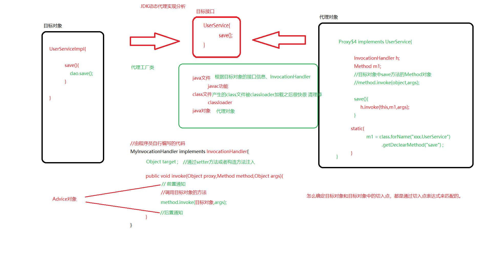

## Spring 容器

  

- IoC（核心中的核心）：Inverse of Control，控制反转。对象的创建权力由程序反转给Spring框架。  
  ---这个由spring通过ioc去帮我们创建对象  
  UserService userService = new UserService();  
  UserDao userDao = new UserDao();  
    - DI（核心中的核心）：Dependency Injection，依赖注入。在Spring框架负责创建Bean对象时，动态的将依赖对象注入到Bean组件中！！  
      ---这个由spring通过DI去帮我们实现的  
      userService.setDao(userDao);  
      new User("lisi");  
    - AOP：Aspect Oriented Programming，面向切面编程。在不修改目标对象的源代码情况下，增强IoC容器中Bean的功能。  
      spring是BOP编程思想的实现。在spring里面一切都是由bean开始。  
  
      UserService是被spring管理的bean，同时spring还可以在管理该bean的同时，  
      按照要求对该bean进行功能增强（符合开闭原则）---使用AOP思想去实现的。  
    - Spring容器：指的就是IoC容器，底层也就是一个BeanFactory（使用简单工厂实现）。  
      spring容器分为基础容器和高级容器，  
      基础容器就是BeanFactory体系  
      高级容器就是ApplicationContext体系  
  
      BeanFactory和ApplicationContext的区别：  
      1.ApplicationContext接口是继承于BeanFactory接口  
      2.BeanFactory创建bean实例的时机是第一次获取该bean实例的时候才去创建。  
      3.ApplicationContext创建bean实例的时机，是初始化的时候，一次性创建所有的单例bean的实例。  

      BeanPostProcessor和BeanFactoryPostProcessor的区别？  
      BeanFactoryPostProcessor：可以在bean创建实例之前，对bean的定义信息（BeanDefinition）进行修改  
      BeanPostProcessor：可以在bean创建实例前后，对bean对象进行后置处理。  
  
      BeanFactory和FactoryBean的区别？  
      BeanFactory：就是ioc的基础容器，管理着spring中需要管理的所有的bean。  
      FactoryBean：只是spring容器管理的bean的一员。  
      只是这个bean比较特殊，它也可以产生一些指定类型bean的实例。  


- 基本容器BeanFactory的学习
		1.通过手写spring基础容器去了解它
			分析如何写spring基础容器
```java
 // 简单工厂案例：
			public class BeanFactory{
			
				public Object getBean(String beanName){
					//根据beanName找对应的bean实例
					if("userService".equals(beanName)){
						UserService userService = new UserService();
						UserDao userDao = new UserDao();
						userService.setDao(userDao);
						return userService;
					}....
				}
			}
			
			优化之后的BeanFactory
			
			public class BeanFactory{
			
				//存放着beanname和bean实例的映射关系
				private Map<String,Object> singletons=new HashMap();
				
				//存放着beanname和bean的定义信息的映射关系
				private Map<String,bean的定义信息> bean的定义信息集合=new HashMap();
				
			
				public Object getBean(String beanName){
					//从集合中回去bean实例
					Object obj = singletons.get(beanName);
					// 如果获取不到，则执行bean的创建------如何创建bean？
					// 程序员得告诉spring如何创建bean---通过配置文件告诉spring
					// 配置文件会配置很多的bean信息，所以要建立beanname（key）和bean信息的映射关系
					// 创建bean需要知道哪些信息呢？class信息、是否单例、属性信息、beanName
					
					//创建完成对象之后，放入单例集合中
					//需要进行DI操作
					//还可能需要一些初始化操作（aop的实现就是在此）。
					
				}
			}
```
			
## 高级容器ApplicationContext源码阅读和循环依赖问题解决  

### 循环依赖问题  
A对象-->B对象 	B对象-->A对象  

循环依赖分为：构造循环依赖、set方法循环依赖  
			构造循环依赖：无法解决，只能修改代码  
			
set方法循环依赖：可以解决，spring就是通过三级缓存来解决的循环依赖  

Spring中bean实例的创建过程：  
1.实例化，也就是new对象  
    通过三级缓存来解决循环依赖，就是在这个时间点  
2.属性填充  
3.初始化  

案例：

			A{
				B
			}
			
			B{
				A
			}
		
			1.A对象完成实例化
			2.进行属性填充
				设置B对象属性，想要获取B对象
					1.B对象完成实例化
					2.进行属性填充
						设置A对象属性，想要获取A对象，直接从三级缓存中获取A对象，然后放入二级缓存
					3.初始化
					4.B对象，从二级缓存中放入一级缓存
					
			3.初始化
			4.A对象，从二级缓存中，放入一级缓存  
三级缓存理解：

			一级缓存：singletonObjects（beanName，Object对象）
				什么时候添加？
					在单例bean完成三部曲之后，会添加到一级缓存中
					
				什么作用？
					我们去getBean的时候，想要的bean，就是放到该缓存中，不需要每次getBean都创建新的bean实例
			二级缓存：earlySingletonObjects（beanName，Object对象）
				什么作用？
					存储提早的暴露未完成初始化的bean实例的引用。
				
			三级缓存：singletonFactories（beanName，ObjectFactory对象）
				什么作用？
					就是通过ObjectFactory，提早的暴露未完成初始化的bean实例的引用。
					想要对提早暴露的bean完成一些BeanPostProcessor操作。
					
					ObjectFactory开始存储的bean（由第一步产生的bean），可能是最终的bean，也可能不是最终的bean。
					我们最终想要的bean，想要调用ObjectFactory的getObject方法去获取，获取到的这个bean，也是未完成初始化的bean
					想要放入提早暴露bean引用的二级缓存中。
				
				什么时候添加到三级缓存中？
					完成三部曲第一个步骤，也就是创建bean实例之后。
					
				什么时候从三级缓存中删除呢？
					第一次，从一级缓存找对象，没有，接下来从二级缓存找，没有，接下来从三级缓存中找到。
					然后放入二级缓存，删除三级缓存。
e.g.  			
			
			A{
				B
				C
			}
			
			B{
				C
			}
			
			C{
				A
			}
			
			以上这个例子：C对象，需要调用getBean两次
			
			那么第一次，先从三级缓存获取到提早暴露的bean，然后将bean放入二级缓存
			
			第二次，调用getBean方法去C对象的时候，就会直接从二级缓存中，获取到C对象（依然是未完成三部曲的bean实例）  

## 动态代理设计模式和AOP相关类的解读  
    
    


	aop基础知识
		aop是什么？它不是spring独家的
		
		aop核心概念：目标对象、代理对象、连接点、切入点、通知、织入、切面/通知器（Advisor）
			
	动态代理模式
		jdk动态代理（默认）	---针对拥有接口的类进行代理
			编写代理对象对应的源代码
			编译源代码为class文件
			加载class文件到JVM中
			在JVM中创建代理对象
			
			
		cglib动态代理		---可以对所有的类进行代理（非final）
		
		需要掌握的动态代理常见问题？
		1.如何创建代理对象？
			jdk：
				Proxy.newInstance(classloader,interfaces,InvocationHandler)
			cglib：
				Enhancer enhancer = new Enhancer();
				enhancer.setSuperClass(..);
				enhancer.setCallback(MethodInterceptor);
				
				enhancer.create();
		2.如何执行代理对象
			jdk：
				InvocationHandl.invoke(proxy,Method,args){
					Method.invoke(target,args);
				}
				
					
				
			cglib：
				MethodInterceptor.intercept(proxy,Method,args,proxyMethod){
					proxyMethod.invokeSuper(proxy,args);
				}


