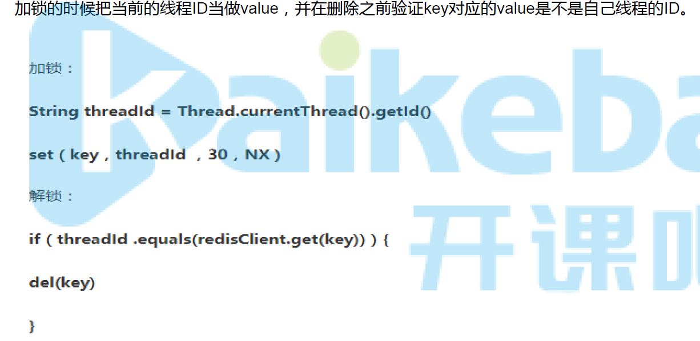

## Spring 事务

* 事务的传播机制  
事务的传播性一般用在事务嵌套的场景，比如一个事务方法里面调用了另外一个事务方法，那么两个方法是各自作为独立的方法提交还是内层的事务合并到外层的事务一起提交，这就是需要事务传播机制的配置来确定怎么样执行。  
常用的事务传播机制如下：

PROPAGATION_REQUIRED  
Spring默认的传播机制，能满足绝大部分业务需求，如果外层有事务，则当前事务加入到外层事务，一块提交，一块回滚。如果外层没有事务，新建一个事务执行  
PROPAGATION_REQUES_NEW  
该事务传播机制是每次都会新开启一个事务，同时把外层事务挂起，当当前事务执行完毕，恢复上层事务的执行。如果外层没有事务，执行当前新开启的事务即可  
PROPAGATION_SUPPORT  
如果外层有事务，则加入外层事务，如果外层没有事务，则直接使用非事务方式执行。完全依赖外层的事务  
PROPAGATION_NOT_SUPPORT  
该传播机制不支持事务，如果外层存在事务则挂起，执行完当前代码，则恢复外层事务，无论是否异常都不会回滚当前的代码  
PROPAGATION_NEVER  
该传播机制不支持外层事务，即如果外层有事务就抛出异常  
PROPAGATION_MANDATORY  
与NEVER相反，如果外层没有事务，则抛出异常  
PROPAGATION_NESTED  
该传播机制的特点是可以保存状态保存点，当前事务回滚到某一个点，从而避免所有的嵌套事务都回滚，即各自回滚各自的，如果子事务没有把异常吃掉，基本还是会引起全部回滚的。  
  
  
* 事务的隔离级别  
事务的隔离级别定义一个事务可能受其他并发务活动活动影响的程度，可以把事务的隔离级别想象为这个事务对于事物处理数据的自私程度。  
  
在一个典型的应用程序中，多个事务同时运行，经常会为了完成他们的工作而操作同一个数据。并发虽然是必需的，但是会导致以下问题：  
  
脏读（Dirty read）  
脏读发生在一个事务读取了被另一个事务改写但尚未提交的数据时。如果这些改变在稍后被回滚了，那么第一个事务读取的数据就会是无效的。  
不可重复读（Nonrepeatable read）  
不可重复读发生在一个事务执行相同的查询两次或两次以上，但每次查询结果都不相同时。这通常是由于另一个并发事务在两次查询之间更新了数据。  
不可重复读重点在修改。  

幻读（Phantom reads）  
幻读和不可重复读相似。当一个事务（T1）读取几行记录后，另一个并发事务（T2）插入了一些记录时，幻读就发生了。在后来的查询中，第一个事务（T1）就会发现一些原来没有的额外记录。  
幻读重点在新增或删除。  
  
在理想状态下，事务之间将完全隔离，从而可以防止这些问题发生。然而，完全隔离会影响性能，因为隔离经常涉及到锁定在数据库中的记录（甚至有时是锁表）。完全隔离要求事务相互等待来完成工作，会阻碍并发。因此，可以根据业务场景选择不同的隔离级别。    

隔离级别	含义  
ISOLATION_DEFAULT	使用后端数据库默认的隔离级别  
ISOLATION_READ_UNCOMMITTED	允许读取尚未提交的更改。可能导致脏读、幻读或不可重复读。  
ISOLATION_READ_COMMITTED	（Oracle 默认级别）允许从已经提交的并发事务读取。可防止脏读，但幻读和不可重复读仍可能会发生。  
ISOLATION_REPEATABLE_READ	（MYSQL默认级别）对相同字段的多次读取的结果是一致的，除非数据被当前事务本身改变。可防止脏读和不可重复读，但幻读仍可能发生。  
ISOLATION_SERIALIZABLE	完全服从ACID的隔离级别，确保不发生脏读、不可重复读和幻影读。这在所有隔离级别中也是最慢的，因为它通常是通过完全锁定当前事务所涉及的数据表来完成的。 

* @Transactional事务几点注意  
  https://blog.csdn.net/kinseygeek/article/details/54931710  

## 分布式事务  
### ACID理论  
事务的特性  ACID  刚性事务
  原子性（Atomicity）：事务是一个原子操作，由一系列动作组成。事务的原子性确保动作要么全部完成，要么完全不起作用。  
  一致性（Consistency）：一旦事务完成（不管成功还是失败），系统必须确保它所建模的业务处于一致的状态，而不会是部分完成部分失败。在现实中的数据不应该被破坏。  
  隔离性（Isolation）：可能有许多事务会同时处理相同的数据，因此每个事务都应该与其他事务隔离开来，防止数据损坏。  
  持久性（Durability）：一旦事务完成，无论发生什么系统错误，它的结果都不应该受到影响，这样就能从任何系统崩溃中恢复过来。通常情况下，事务的结果被写到持久化存储器中。

### CAP理论与BASE理论柔性事物  
https://blog.csdn.net/u014034683/article/details/89422804  
CAP理论  
* C:Consistency, 一致性，在分布式系统中的所有数据备份，在同一时刻具有同样的值，所有节点在同一时刻读取的数据都是最新
的数据副本。  
* A:Availability, 可用性，好的相应性能，完全的可用性指的是在任何故障模型下，服务都会在有限的时间内处理完成并进行相应。    
* P:Partition tolerance,分区容忍性。尽管网络上有部分消息丢失，但系统仍然可继续工作。  
     

CAP原理指的是，这三个要素最多只能同时实现两点，不可能三者兼顾。 因此在进行分布式架构设计时，必须做出取舍。
而对于分布式数据系统，分区容忍性(P)是基本要求，否则就失去了价值。
因此设计分布式数据系统，就是在一致性和可用性之间取一个平衡。
对于大多数web应用，其实并不需要强一致性，因此牺牲一致性而换取高可用性，是目前多数分布式数据库产品的方向。  
当然，牺牲一致性，并不是完全不管数据的一致性，否则数据是混乱的，那么系统可用性再高分布式再好也没有了价值。
牺牲一致性，只是不再要求关系型数据库中的强一致性，而是只要系统能达到最终一致性即可，
考虑到客户体验，这个最终一致的时间窗口，要尽可能的对用户透明，也就是需要保障“用户感知到的一致性”。
通常是通过数据的多份异步复制来实现系统的高可用和数据的最终一致性的，“用户感知到的一致性”的时间窗口则取决于数据复制到一致状态的时间。
AP/CP
---------  
BASE理论  柔性事物，基本可用，最终一致  
基本可用 BA: (Basically Available)  
指分布式系统在出现故障的时候，允许损失部分可用性，保证核心可用。但不等价于不可用。比如：搜索引擎0.5秒返回查询结果，但由于故障，2秒响应查询结果；网页访问过大时，部分用户提供降级服务等。简单来说就是基本可用。  
软状态 S: (Soft State)  
软状态是指允许系统存在中间状态，并且该中间状态不会影响系统整体可用性。即允许系统在不同节点间副本同步的时候存在延时。简单来说就是状态可以在一段时间内不同步。  
最终一致性 E: (Eventually Consistent)   
系统中的所有数据副本经过一定时间后，最终能够达到一致的状态，不需要实时保证系统数据的强一致性。  
最终一致性是弱一致性的一种特殊情况。BASE理论面向的是大型高可用可扩展的分布式系统，通过牺牲强一致性来获得可用性。  
ACID是传统数据库常用的概念设计，追求强一致性模型。简单来说就是在一定的时间窗口内， 最终数据达成一致即可。  
---------  
柔性事物的实现  
两阶段型  
补偿型  
异步确保型  
最大努力通知型  
   

---------  
@Transactional事务几点注意  
1. 不要在接口上声明@Transactional ，而要在具体类的方法上使用 @Transactional 注解，否则注解可能无效。  
2. 不要图省事，将@Transactional放置在类级的声明中，放在类声明，会使得所有方法都有事务。故@Transactional应该放在方法级别，不需要使用事务的方法，就不要放置事务，比如查询方法。否则对性能是有影响的。  
3. 使用了@Transactional的方法，对同一个类里面的方法调用， @Transactional无效。比如有一个类Test，它的一个方法A，A再调用Test本类的方法B（不管B是否public还是private），但A没有声明注解事务，而B有。则外部调用A之后，B的事务是不会起作用的。（经常在这里出错）  
   失效原因：@Transactional是在SpringAOP代理来管理的，只有当事务方法被外部类调用时候才会由Spring生成的代理对象来管理。
   Transactional是Spring提供的事务管理注解。

重点在于，Spring采用动态代理(AOP)实现对bean的管理和切片，它为我们的每个class生成一个代理对象。只有在代理对象之间进行调用时，可以触发切面逻辑。

而在同一个class中，方法B调用方法A，调用的是原对象的方法，而不通过代理对象。所以Spring无法切到这次调用，也就无法通过注解保证事务性了。

也就是说，在同一个类中的方法调用，则不会被方法拦截器拦截到，因此事务不会起作用。
4. 使用了@Transactional的方法，只能是public，@Transactional注解的方法都是被外部其他类调用才有效，故只能是public。道理和上面的有关联。故在 protected、private 或者 package-visible 的方法上使用 @Transactional 注解，它也不会报错，但事务无效。  

   
   

------------------
分布式锁  
   

DB实现分布式锁  
   
   
Redis实现分布式锁  
   
存在错误删除：A线程执行的很慢30s过期并自动释放了锁，B获取锁并执行， 
此时，A线程执行完了，接着执行del释放锁，但是B还没执行完，线程A实际上删除的是B的锁。    
错误删除锁的解决方案：  删除时带着线程id的判断/redis原子化操作(lua script)  
   
   

 
