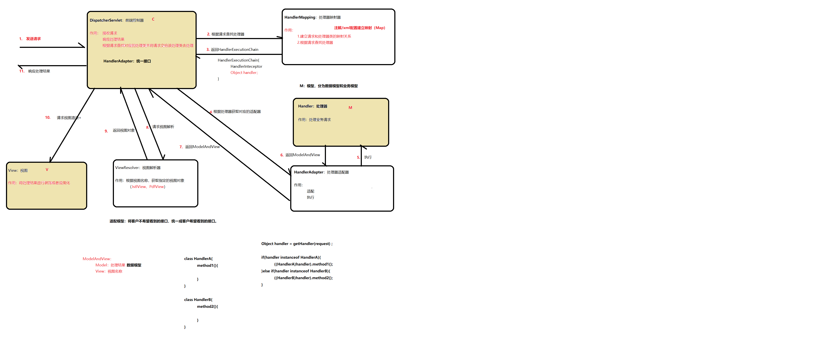
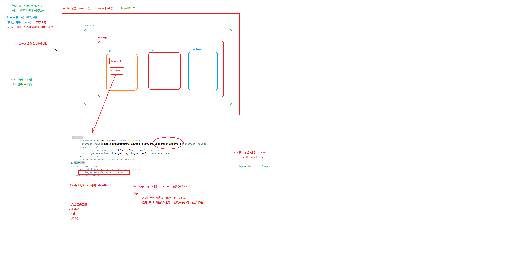

## Spring MVC Demo

  
  

手写springmvc框架总结
需求：
发送http请求，服务端完成添加用户需求
发送http请求，服务端完成查询用户需求

		V1.0
			DispatcherServlet类
				接收请求、响应结果
				查找处理器
				执行相应的处理器（调用处理器的方法去处理请求）
			Handler类：是一个普通的Java类，它不是Servlet类
				作用：处理请求
				
				如何编写Handler类呢？
					高仿Servlet的请求处理方法
					1.HttpRequestHandler接口（规范大家如何编写Handler类去处理请求）
						void handleRequest(request,response)；
						
					2.SimpleControllerHandler接口
						ModelAndView handleRequest(request,response)；
						对于处理器类的处理结果，有可能还需要处理，则把处理结果和最终显示的视图名称封装到一个对象中
						
					3.实现@Controller注解和@RequestMapping注解的类（最常用的方式）
					
				结论：
					Handler类的编写方式有多种，而且类型都无法统一。需要有个适配器去处理一下。
					
			HandlerMapping类：
				作用：请求映射和查找请求
				
				去哪儿找Handler？
					如何建立请求映射？
						xml
							<bean name="/xx" class="xxx">
							<bean>
								<pros>
									<prop key="/xxx">xxx</prop>
								</props>
							</bean>
						properties
						Map集合
						
				怎么找Handler？
				
				结论：
					建立映射的方式有多种，所以说HandlerMapping应该有多个
					每个HandlerMapping负责的映射来源是不一样的。
					总有一个HandlerMapping是你的菜。
					
				BeanNameURLHandlerMapping
				
				多个HandlerMapping类，如何找到合适的类去完成我们的需求，需要使用策略模式！！！
				
				
				策略模式：
					主要是为了解决if。。。else这种代码
					
					角色：
						环境类
						抽象策略类
						具体策略类
						
					使用技巧：
						1.建立策略集合
						2.初始化策略集合
						3.遍历策略集合
						4.提供一个方法可以判断该策略算法合适
						
						
			HandlerAdapter类：
				作用：将DispatcherServlet类不想见到的Handler类，适配成统一的HandlerAdapter类型。
				
				使用了适配器模式
					为什么使用适配器模式？
					
					当DispatcherServlet类中想使用现成的Handler类的时候，发现Handler类型不统一，DispatcherServlet类比较生气。
					
					
		V2.0
			编写新的Handler（使用注解方式）
				类上加@Controller注解
				方法上加@RequestMapping注解（便于HandlerMapping建立注解方式下的请求映射关系）
				方法参数需要知道请求中的参数有哪些，我们就可以一一对应的写到我们Controller方法参数中去获取这些参数
				
				使用注解方式去编写的Handler，一个handler类中可以处理N个请求，和HttpRequestHandler是有很大的进步的。
				
				
			编写新的HandlerAdapter
				1.将Object类型的handler强转为HandlerMethod类型
				2.取出Method对象和Controller对象
				3.要处理方法参数的绑定
				4.通过反射调用对应的方法，并得到返回值
				5.处理返回值
				
				
			编写新的HandlerMapping
				分析
					RequestMapping注解中的【请求URL】和它修饰的【方法】之间建立了映射关系.需要针对这种映射关系进行解析，然后放入Map集合中。
					按理说一个请求URL应该对应一个Handler类。而现在我们对应的是一个Controller方法。
					此时要注意，在注解方式编写的Controller类这种实现，Controller类不是真正的Handler类，真正的Handler类是【Controller类+对应的方法】
					
					对于这个组合，我们提供了一个对象去封装他们，这个对象HandlerMethod对象（【Object handler，Method method】）
					
					最终我们得出结论：【请求URL】和【HandlerMethod】建立映射关系，HandlerMethod才是DispatcherServlet类中需要的Handler类，而Controller不是Handler类。
				
				编程思路
					1.要获取所有的BeanDefinition，获取Class对象
					2.查找带有Controller注解的类
					3.获取该Controller类中所有带@RequestMapping注解的方法
					4.取出@RequestMapping注解中的value值（请求URL）。
					5.获取@RequestMapping注解对应的方法的Method对象
					6.根据BeanDefinition中的beanName从ioc容器中获取Controller对象
					7.讲Method对象和Controller对象封装到HandlerMethod对象中
					8.建立映射关系

