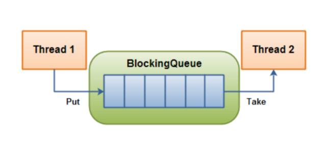
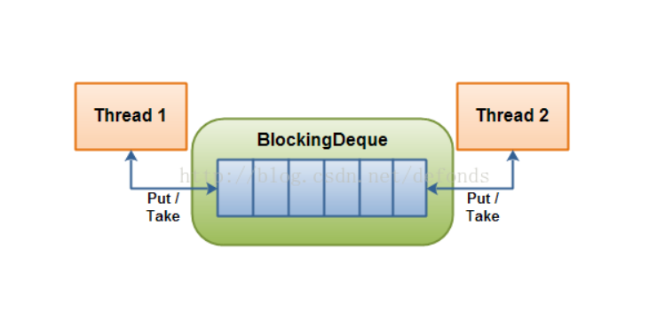

## BlockingQueue & BlockingDeque
### BlockingQueue
BlockingQueue 通常用于一个线程生产对象，而另外一个线程消费这些对象的场景。  
会阻塞。


### BlockingQueue的方法
BlockingQueue 具有 4 组不同的方法用于插入、移除以及对队列中的元素进行检查。如果请求的操作不能得到立即执行的话，每个方法的表现也不同。这些方法如下:  

| | 抛异常 | 特定值(true/false) | 阻塞 | 超时(true/false)|
| --- | --- | --- | --- | --- |
|插入 |add(o)   |offer(o)|put(o)   |offer(o,timeout,timeunit)   |
|移除 |remove(o)|poll() |take()  |poll(timeout,timeunit)   |
|检查 |element()|peek()|  |   |
* 不能插入null， 否则会抛NullPointerException
* 因为是队列，所以可以访问队列中的任何元素，但是操作中间的元素效率不高（队列的数据结构导致的）。

### 示例
* [**BlockingQueueDemo.java**](../main/java/com/example/jucdemo/blockingqueue/BlockingQueueDemo.java)  
主要实现类  
* ArrayBlockingQueue  
  1. 数组，一旦初始化了大小就无法改变。  
  2. FIFO（先进先出）。  
  3. 可带泛型。  
```java
BlockingQueue queue = new ArrayBlockingQueue(1024);
BlockingQueue<String> queue = new ArrayBlockingQueue<String>(1024);
```
* DelayQueue延迟队列  
DelayQueue 对元素进行持有直到一个特定的延迟到期。注入其中的元素必须实现 java.util.concurrent.Delayed 接口，该接口定义:  
```java
public interface Delayed extends Comparable<Delayed< {
    public long getDelay(TimeUnit timeUnit);
}
```  
DelayQueue 将会在每个元素的 getDelay() 方法返回的值的时间段之后才释放掉该元素。如果返回的是 0 或者负值，延迟将被认为过期，该元素将会在 DelayQueue 的下一次 take  被调用的时候被释放掉。

* LinkedBlockingQueue链式阻塞队列
* PriorityBlockingQueue优先级阻塞队列  
PriorityBlockingQueue 是一个无界的并发队列。它使用了和类 java.util.PriorityQueue 一样的排序规则。你无法向这个队列中插入 null 值。
所有插入到 PriorityBlockingQueue 的元素必须实现 java.lang.Comparable 接口。因此该队列中元素的排序就取决于你自己的 Comparable 实现。
注意 PriorityBlockingQueue 对于具有相等优先级(compare() == 0)的元素并不强制任何特定行为。  
* SynchronousQueue同步队列  
SynchronousQueue 是一个特殊的队列，它的内部同时只能够容纳单个元素。如果该队列已有一元素的话，试图向队列中插入一个新元素的线程将会阻塞，直到另一个线程将该元素从队列中抽走。同样，如果该队列为空，试图向队列中抽取一个元素的线程将会阻塞，直到另一个线程向队列中插入了一条新的元素。
据此，把这个类称作一个队列显然是夸大其词了。  


### BlockingDeque
继承BlockingQueue接口。
双向队列。  
从任意一端插入或者抽取元素的队列。  
阻塞。  


### BlockingDeque的方法
BlockingQuDeque 具有 4 组不同的方法用于插入、移除以及对队列中的元素进行检查。如果请求的操作不能得到立即执行的话，每个方法的表现也不同。这些方法如下:

| | 抛异常 | 特定值(true/false) | 阻塞 | 超时(true/false)|
| --- | --- | --- | --- | --- |
|插入 |addFirst(o)/addLast(o)  |offerFirst(o)/offerLast(o)|puputFirst(o)/putLast(o)|offerFirst(o, timeout, timeunit)/offerLast(o, timeout, timeunit)|
|移除 |removeFirst(o)/removeLast(o)|pollFirst(o)/pollLast(o)|takeFirst(o)/takeLast(o)|pollFirst(timeout, timeunit)/pollLast(timeout, timeunit)|
|检查 |getFirst(o)/getLast(o)|peekFirst(o)/peekLast(o)|  |   |

### 示例
* [**BlockingDequeDemo.java**](../main/java/com/example/jucdemo/blockingdeque/BlockingDequeDemo.java)  
主要实现类：LinkedBlockingDeque
