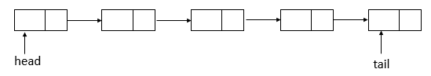
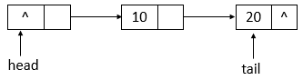
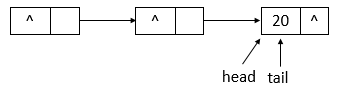

## ConcurrentLinkedQueue
ConcurrentLinkedQueue是线程安全的队列，按照FIFO进行排序。  
队列中不允许有null元素。  
### 数据结构
  
链表结构  
### 内部类Node
```java
private static class Node<E> {
    // 元素
    volatile E item;
    // next域
    volatile Node<E> next;

    /**
        * Constructs a new node.  Uses relaxed write because item can
        * only be seen after publication via casNext.
        */
    // 构造函数
    Node(E item) {
        // 设置item的值
        UNSAFE.putObject(this, itemOffset, item);
    }
    // 比较并替换item值
    boolean casItem(E cmp, E val) {
        return UNSAFE.compareAndSwapObject(this, itemOffset, cmp, val);
    }
    
    void lazySetNext(Node<E> val) {
        // 设置next域的值，并不会保证修改对其他线程立即可见
        UNSAFE.putOrderedObject(this, nextOffset, val);
    }
    // 比较并替换next域的值
    boolean casNext(Node<E> cmp, Node<E> val) {
        return UNSAFE.compareAndSwapObject(this, nextOffset, cmp, val);
    }

    // Unsafe mechanics
    // 反射机制
    private static final sun.misc.Unsafe UNSAFE;
    // item域的偏移量
    private static final long itemOffset;
    // next域的偏移量
    private static final long nextOffset;

    static {
        try {
            UNSAFE = sun.misc.Unsafe.getUnsafe();
            Class<?> k = Node.class;
            itemOffset = UNSAFE.objectFieldOffset
                (k.getDeclaredField("item"));
            nextOffset = UNSAFE.objectFieldOffset
                (k.getDeclaredField("next"));
        } catch (Exception e) {
            throw new Error(e);
        }
    }
}
```
Node就是链表的节点，包含item（当前元素）和next（下一个节点）。使用CAS保证原子性。  

###核心函数
*offer函数  
```java
public boolean offer(E e) {
    // 元素不为null
    checkNotNull(e);
    // 新生一个结点
    final Node<E> newNode = new Node<E>(e);

    for (Node<E> t = tail, p = t;;) { // 无限循环
        // q为p结点的下一个结点
        Node<E> q = p.next;
        if (q == null) { // q结点为null
            // p is last node
            if (p.casNext(null, newNode)) { // 比较并进行替换p结点的next域
                // Successful CAS is the linearization point
                // for e to become an element of this queue,
                // and for newNode to become "live".
                if (p != t) // p不等于t结点，不一致    // hop two nodes at a time
                    // 比较并替换尾结点
                    casTail(t, newNode);  // Failure is OK.
                // 返回
                return true;
            }
            // Lost CAS race to another thread; re-read next
        }
        else if (p == q) // p结点等于q结点
            // We have fallen off list.  If tail is unchanged, it
            // will also be off-list, in which case we need to
            // jump to head, from which all live nodes are always
            // reachable.  Else the new tail is a better bet.
            // 原来的尾结点与现在的尾结点是否相等，若相等，则p赋值为head，否则，赋值为现在的尾结点
            p = (t != (t = tail)) ? t : head;
        else
            // Check for tail updates after two hops.
            // 重新赋值p结点
            p = (p != t && t != (t = tail)) ? t : q;
    }
}
```
offer函数用于将指定元素插入此队列的尾部。下面模拟offer函数的操作，队列状态的变化(假设单线程添加元素，连续添加10、20两个元素)。  
  
若ConcurrentLinkedQueue的初始状态如上图所示，即队列为空。单线程添加元素，此时，添加元素10，则状态如下所示  
  
如上图所示，添加元素10后，tail没有变化，还是指向之前的结点，继续添加元素20，则状态如下所示
  
如上图所示，添加元素20后，tail指向了最新添加的结点。  

*poll函数
```java
public E poll() {
    restartFromHead:
    for (;;) { // 无限循环
        for (Node<E> h = head, p = h, q;;) { // 保存头结点
            // item项
            E item = p.item;

            if (item != null && p.casItem(item, null)) { // item不为null并且比较并替换item成功
                // Successful CAS is the linearization point
                // for item to be removed from this queue.
                if (p != h) // p不等于h    // hop two nodes at a time
                    // 更新头结点
                    updateHead(h, ((q = p.next) != null) ? q : p); 
                // 返回item
                return item;
            }
            else if ((q = p.next) == null) { // q结点为null
                // 更新头结点
                updateHead(h, p);
                return null;
            }
            else if (p == q) // p等于q
                // 继续循环
                continue restartFromHead;
            else
                // p赋值为q
                p = q;
        }
    }
}
```
此函数用于获取并移除此队列的头，如果此队列为空，则返回null。下面模拟poll函数的操作，队列状态的变化(假设单线程操作，状态为之前offer10、20后的状态，poll两次)。    
  
队列初始状态如上图所示，在poll操作后，队列的状态如下图所示  
  
如上图可知，poll操作后，head改变了，并且head所指向的结点的item变为了null。再进行一次poll操作，队列的状态如下图所示。  
  
如上图可知，poll操作后，head结点没有变化，只是指示的结点的item域变成了null。  

*remove函数  
```java
public boolean remove(Object o) {
    // 元素为null，返回
    if (o == null) return false;
    Node<E> pred = null;
    for (Node<E> p = first(); p != null; p = succ(p)) { // 获取第一个存活的结点
        // 第一个存活结点的item值
        E item = p.item;
        if (item != null &&
            o.equals(item) &&
            p.casItem(item, null)) { // 找到item相等的结点，并且将该结点的item设置为null
            // p的后继结点
            Node<E> next = succ(p);
            if (pred != null && next != null) // pred不为null并且next不为null
                // 比较并替换next域
                pred.casNext(p, next);
            return true;
        }
        // pred赋值为p
        pred = p;
    }
    return false;
}
```
此函数用于从队列中移除指定元素的单个实例(如果存在)。其中，
first函数用于找到链表中第一个存活的结点。  
succ用于获取结点的下一个结点。如果结点的next域指向自身，则返回head头结点，否则，返回next结点。  
下面模拟remove函数的操作，队列状态的变化(假设单线程操作，状态为之前offer10、20后的状态，执行remove(10)、remove(20)操作)。  
  
如上图所示，为ConcurrentLinkedQueue的初始状态，remove(10)后的状态如下图所示  
  
如上图所示，当执行remove(10)后，head指向了head结点之前指向的结点的下一个结点，并且head结点的item域置为null。继续执行remove(20)，状态如下图所示    
  
如上图所示，执行remove(20)后，head与tail指向同一个结点，item域为null。  


### 示例
* [**ConcurrentLQDemo.java**](../main/java/com/example/jucdemo/concurrentlinkedqueue/ConcurrentLQDemo.java)


### ConcurrentLinkedQueue和LinkedBlockingQueue对比  

|特点|LinkedBlockingQueue|ConcurrentLinkedQueue|
| --- | --- | ---|
|阻塞性|阻塞队列，实现blocking queue接口|非阻塞队列|
|队列大小|有界队列，初始化时可设置队列大小，默认最大为Integer.MAX_VALUE|无界队列|
|锁|有锁|无锁|
|实现|putLock/takeLock,双锁队列|并发，CAS，性能高|
|消费者|适用于多生产者，单一消费者的情况。 因为多消费者会轮询阻塞导致cpu飙高，需要结合timeout使用。|适用于多消费者的情况，如果是空队列不会阻塞，马上返回null，所以要手动处理等待逻辑|

