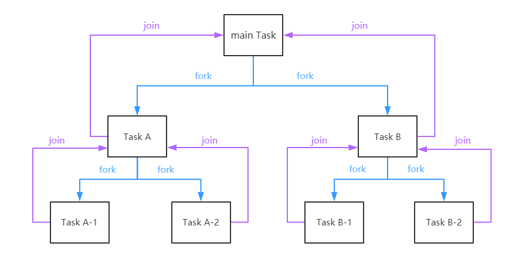
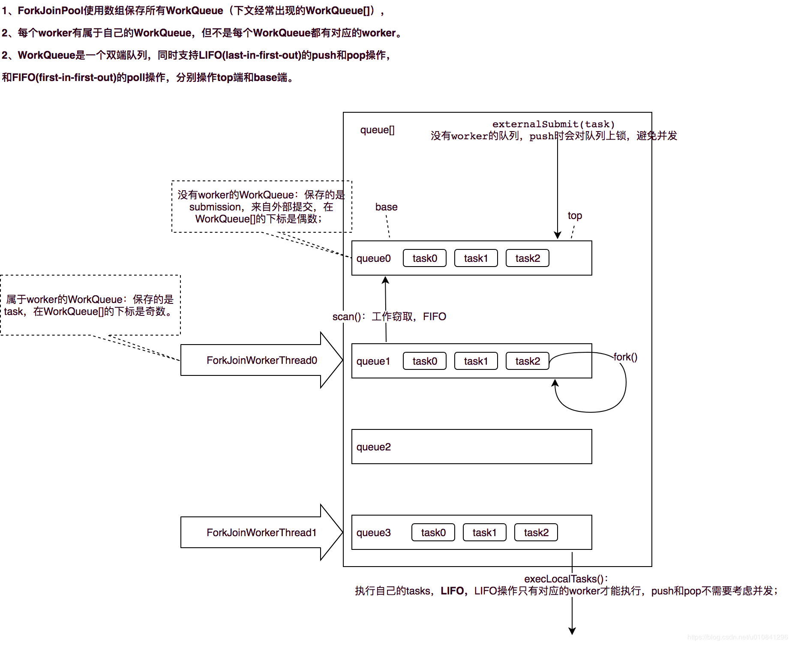
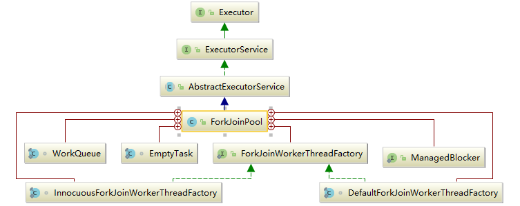
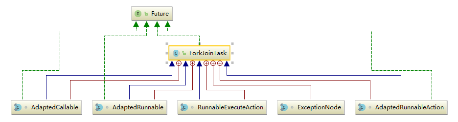
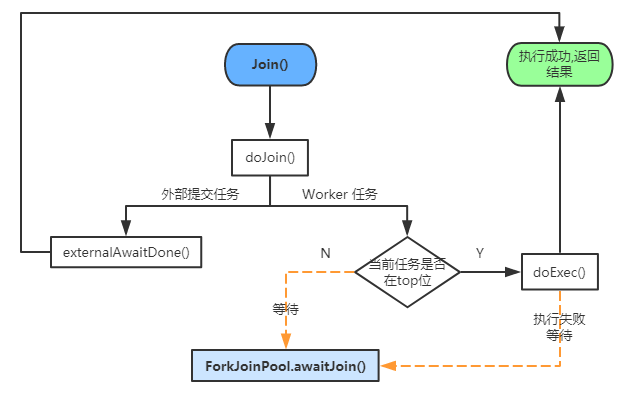

## Fork/Join框架
Fork/Join框架是Java并发工具包中的一种可以将一个大任务拆分为很多小任务来异步执行的工具，自JDK1.7引入。  
Fork/Join 技术是分治算法(Divide-and-Conquer)的并行实现，它是一项可以获得良好的并行性能的简单且高效的设计技术。  

### 三个模块
Fork/Join框架主要包含三个模块:  
* 任务对象: ForkJoinTask (包括RecursiveTask、RecursiveAction 和 CountedCompleter)  
  * RecursiveTask:ForkJoinTask 的子类，是一个可以递归执行的 ForkJoinTask  
  * RecursiveAction 是一个无返回值的 RecursiveTask  
  * CountedCompleter 在任务完成执行后会触发执行一个自定义的钩子函数  
  * 在实际运用中，我们一般都会继承 RecursiveTask 、RecursiveAction 或 CountedCompleter 来实现我们的业务需求，而不会直接继承 ForkJoinTask 类。    
* 执行Fork/Join任务的线程: ForkJoinWorkerThread  
* 线程池: ForkJoinPool  
ForkJoinPool可以通过池中的ForkJoinWorkerThread来处理ForkJoinTask任务  

### 核心算法：分治算法(Divide-and-Conquer)  
分治算法的基本思想是将一个规模为N的问题分解为K个规模较小的子问题，这些子问题相互独立且与原问题性质相同。求出子问题的解，就可得到原问题的解。  
  

### 核心算法：工作窃取算法(work-stealing)  
1. 每个工作线程都有一个属于自己的工作队列(WorkQueue)，双端队列，FIFO；  
2. 队列支持三个功能：  
  * push/pop 只能被队列的所有者调用；  
  * poll 可以被其他线程调用；  
3. 子任务继续被划分试(fork),都会被push到自己的队列中；  
4. 一般情况下，工作线程从自己的队列中执行任务；但是自己的队列空了的时候就随机从另一个线程的队列末尾窃取(poll)任务。
5. 提交到线程池的外部任务放到workQueue的偶数槽位， 内部分隔(Fork)的任务放到基数槽位。  
  
   

### 类之间的关系  
#### ForkJoinPool继承关系
  
* ForkJoinWorkerThreadFactory: 内部线程工厂接口，用于创建工作线程ForkJoinWorkerThread  
* DefaultForkJoinWorkerThreadFactory: ForkJoinWorkerThreadFactory 的默认实现类  
* InnocuousForkJoinWorkerThreadFactory: 实现了 ForkJoinWorkerThreadFactory，无许可线程工厂，当系统变量中有系统安全管理相关属性时，默认使用这个工厂创建工作线程。  
* EmptyTask: 内部占位类，用于替换队列中 join 的任务。  
* ManagedBlocker: 为 ForkJoinPool 中的任务提供扩展管理并行数的接口，一般用在可能会阻塞的任务(如在 Phaser 中用于等待 phase 到下一个generation)。  
* WorkQueue: ForkJoinPool 的核心数据结构，本质上是work-stealing 模式的双端任务队列，内部存放 ForkJoinTask 对象任务，使用 @Contented 注解修饰防止伪共享。  
  * 工作线程在运行中产生新的任务(通常是因为调用了 fork())时，此时可以把 WorkQueue 的数据结构视为一个栈，新的任务会放入栈顶(top 位)；工作线程在处理自己工作队列的任务时，按照 LIFO 的顺序。  
  * 工作线程在处理自己的工作队列同时，会尝试窃取一个任务(可能是来自于刚刚提交到 pool 的任务，或是来自于其他工作线程的队列任务)，此时可以把 WorkQueue 的数据结构视为一个 FIFO 的队列，窃取的任务位于其他线程的工作队列的队首(base位)  
* 伪共享状态: 缓存系统中是以缓存行(cache line)为单位存储的。缓存行是2的整数幂个连续字节，一般为32-256个字节。最常见的缓存行大小是64个字节。当多线程修改互相独立的变量时，如果这些变量共享同一个缓存行，就会无意中影响彼此的性能，这就是伪共享  

#### ForkJoinTask继承关系  
  
ForkJoinTask是Future的轻量级实现，也是一个可取消的异步运算任务，主要用在纯粹是计算的函数式任务或者操作完全独立的对象计算任务。  
fork 是主运行方法，用于异步执行；而 join 方法在任务结果计算完毕之后才会运行，用来合并或返回计算结果；  
ExceptionNode 是用于存储任务执行期间的异常信息的单向链表；  
AdaptedCallable/AdaptedRunnable/RunnableExecuteAction/AdaptedRunnableAction是Runnable/Callable的适配器类，
用于把Runnable/Callable转化为ForkJoinTask。  

### 源码解析  
* ForkJoinPool与内部类WorkQueue共享的常量；  
```java
// Constants shared across ForkJoinPool and WorkQueue

// 限定参数
static final int SMASK = 0xffff;        //  低位掩码，也是最大索引位
static final int MAX_CAP = 0x7fff;        //  工作线程最大容量
static final int EVENMASK = 0xfffe;        //  偶数低位掩码
static final int SQMASK = 0x007e;        //  workQueues 数组最多64个槽位

// ctl 子域和 WorkQueue.scanState 的掩码和标志位
static final int SCANNING = 1;             // 标记是否正在运行任务
static final int INACTIVE = 1 << 31;       // 失活状态  负数
static final int SS_SEQ = 1 << 16;       // 版本戳，防止ABA问题

// ForkJoinPool.config 和 WorkQueue.config 的配置信息标记
static final int MODE_MASK = 0xffff << 16;  // 模式掩码
static final int LIFO_QUEUE = 0; //LIFO队列
static final int FIFO_QUEUE = 1 << 16;//FIFO队列
static final int SHARED_QUEUE = 1 << 31;       // 共享模式队列，负数
```
* ForkJoinPool常量和实例；  
  ForkJoinPool 的内部状态都是通过一个64位的 long 型 变量ctl来存储，它由四个16位的子域组成:  
  * AC: 正在运行工作线程数减去目标并行度，高16位  
  * TC: 总工作线程数减去目标并行度，中高16位  
  * SS: 栈顶等待线程的版本计数和状态，中低16位  
  * ID: 栈顶 WorkQueue 在池中的索引(poolIndex)，低16位  
某些地方也提取了ctl的低32位(sp=(int)ctl)来检查工作线程状态，后面会说到。    
```java
//  低位和高位掩码
private static final long SP_MASK = 0xffffffffL;
private static final long UC_MASK = ~SP_MASK;

// 活跃线程数
private static final int AC_SHIFT = 48;
private static final long AC_UNIT = 0x0001L << AC_SHIFT; //活跃线程数增量
private static final long AC_MASK = 0xffffL << AC_SHIFT; //活跃线程数掩码

// 工作线程数
private static final int TC_SHIFT = 32;
private static final long TC_UNIT = 0x0001L << TC_SHIFT; //工作线程数增量
private static final long TC_MASK = 0xffffL << TC_SHIFT; //掩码
private static final long ADD_WORKER = 0x0001L << (TC_SHIFT + 15);  // 创建工作线程标志

// 池状态
private static final int RSLOCK = 1;
private static final int RSIGNAL = 1 << 1;
private static final int STARTED = 1 << 2;
private static final int STOP = 1 << 29;
private static final int TERMINATED = 1 << 30;
private static final int SHUTDOWN = 1 << 31;

// 实例字段
volatile long ctl;                   // 主控制参数
volatile int runState;               // 运行状态锁
final int config;                    // 并行度|模式
int indexSeed;                       // 用于生成工作线程索引
volatile WorkQueue[] workQueues;     // 主对象注册信息，workQueue
final ForkJoinWorkerThreadFactory factory;// 线程工厂
final UncaughtExceptionHandler ueh;  // 每个工作线程的异常信息
final String workerNamePrefix;       // 用于创建工作线程的名称
volatile AtomicLong stealCounter;    // 偷取任务总数，也可作为同步监视器

/** 静态初始化字段 */
//线程工厂
public static final ForkJoinWorkerThreadFactory defaultForkJoinWorkerThreadFactory;
//启动或杀死线程的方法调用者的权限
private static final RuntimePermission modifyThreadPermission;
// 公共静态pool
static final ForkJoinPool common;
//并行度，对应内部common池
static final int commonParallelism;
//备用线程数，在tryCompensate中使用
private static int commonMaxSpares;
//创建workerNamePrefix(工作线程名称前缀)时的序号
private static int poolNumberSequence;
//线程阻塞等待新的任务的超时值(以纳秒为单位)，默认2秒
private static final long IDLE_TIMEOUT = 2000L * 1000L * 1000L; // 2sec
//空闲超时时间，防止timer未命中
private static final long TIMEOUT_SLOP = 20L * 1000L * 1000L;  // 20ms
//默认备用线程数
private static final int DEFAULT_COMMON_MAX_SPARES = 256;
//阻塞前自旋的次数，用在在awaitRunStateLock和awaitWork中
private static final int SPINS  = 0;
//indexSeed的增量
private static final int SEED_INCREMENT = 0x9e3779b9;
```
* WorkQueue相关属性；  
```java
//初始队列容量，2的幂
static final int INITIAL_QUEUE_CAPACITY = 1 << 13;
//最大队列容量
static final int MAXIMUM_QUEUE_CAPACITY = 1 << 26; // 64M

// 实例字段
volatile int scanState;    // Woker状态, <0: inactive; odd:scanning
int stackPred;             // 记录前一个栈顶的ctl
int nsteals;               // 偷取任务数
int hint;                  // 记录偷取者索引，初始为随机索引
int config;                // 池索引和模式
volatile int qlock;        // 1: locked, < 0: terminate; else 0
volatile int base;         //下一个poll操作的索引(栈底/队列头)
int top;                   //  下一个push操作的索引(栈顶/队列尾)
ForkJoinTask<?>[] array;   // 任务数组
final ForkJoinPool pool;   // the containing pool (may be null)
final ForkJoinWorkerThread owner; // 当前工作队列的工作线程，共享模式下为null
volatile Thread parker;    // 调用park阻塞期间为owner，其他情况为null
volatile ForkJoinTask<?> currentJoin;  // 记录被join过来的任务
volatile ForkJoinTask<?> currentSteal; // 记录从其他工作队列偷取过来的任务
```
* 任务运行状态；  
```java
/** 任务运行状态 */
volatile int status; // 任务运行状态
static final int DONE_MASK   = 0xf0000000;  // 任务完成状态标志位
static final int NORMAL      = 0xf0000000;  // must be negative
static final int CANCELLED   = 0xc0000000;  // must be < NORMAL
static final int EXCEPTIONAL = 0x80000000;  // must be < CANCELLED
static final int SIGNAL      = 0x00010000;  // must be >= 1 << 16 等待信号
static final int SMASK       = 0x0000ffff;  //  低位掩码
```
* 构造函数  
```java
/**
 * parallelism: 并行度，默认为CPU数，最小为1
 * factory: 工作线程工厂
 * handler: 处理工作线程运行任务时的异常情况类，默认为null
 * asyncMode: 是否为异步模式，默认为 false。如果为true，表示子任务的执行遵循 FIFO 顺序并且任务不能被合并(join)，这种模式适用于工作线程只运行事件类型的异步任务
 */
public ForkJoinPool(int parallelism,
                    ForkJoinWorkerThreadFactory factory,
                    UncaughtExceptionHandler handler,
                    boolean asyncMode) {
    this(checkParallelism(parallelism),
            checkFactory(factory),
            handler,
            asyncMode ? FIFO_QUEUE : LIFO_QUEUE,
            "ForkJoinPool-" + nextPoolId() + "-worker-");
    checkPermission();
}
```
在多数场景使用时，如果没有太强的业务需求，我们一般直接使用 ForkJoinPool 中的common池，在JDK1.8之后提供了ForkJoinPool.commonPool()方法可以直接使用common池，来看一下它的构造  
```java
private static ForkJoinPool makeCommonPool() {
    int parallelism = -1;
    ForkJoinWorkerThreadFactory factory = null;
    UncaughtExceptionHandler handler = null;
    try {  // ignore exceptions in accessing/parsing
        String pp = System.getProperty
                ("java.util.concurrent.ForkJoinPool.common.parallelism");//并行度
        String fp = System.getProperty
                ("java.util.concurrent.ForkJoinPool.common.threadFactory");//线程工厂
        String hp = System.getProperty
                ("java.util.concurrent.ForkJoinPool.common.exceptionHandler");//异常处理类
        if (pp != null)
            parallelism = Integer.parseInt(pp);
        if (fp != null)
            factory = ((ForkJoinWorkerThreadFactory) ClassLoader.
                    getSystemClassLoader().loadClass(fp).newInstance());
        if (hp != null)
            handler = ((UncaughtExceptionHandler) ClassLoader.
                    getSystemClassLoader().loadClass(hp).newInstance());
    } catch (Exception ignore) {
    }
    if (factory == null) {
        if (System.getSecurityManager() == null)
            factory = defaultForkJoinWorkerThreadFactory;
        else // use security-managed default
            factory = new InnocuousForkJoinWorkerThreadFactory();
    }
    if (parallelism < 0 && // default 1 less than #cores
            (parallelism = Runtime.getRuntime().availableProcessors() - 1) <= 0)
        parallelism = 1;//默认并行度为1
    if (parallelism > MAX_CAP)
        parallelism = MAX_CAP;
    return new ForkJoinPool(parallelism, factory, handler, LIFO_QUEUE,
            "ForkJoinPool.commonPool-worker-");
}
```
### Fork/Join框架执行流程
  
#### 外部任务执行过程  
向ForkJoinPool提交任务有三种方式，都是通过调用externalPush()来完成：  
1. invoke()会等待任务计算完毕并返回结果；  
2. execute()直接向池子提交一个任务来异步执行，无返回结果；  
3. submit()提交任务，异步执行，返回提交的任务，可通过task.get()获取结果；  

* externalPush(ForkJoinTask<?> task)  
```java
//添加给定任务到submission队列中
final void externalPush(ForkJoinTask<?> task) {
    WorkQueue[] ws;
    WorkQueue q;
    int m;
    int r = ThreadLocalRandom.getProbe();//探针值，用于计算WorkQueue槽位索引
    int rs = runState;
    if ((ws = workQueues) != null && (m = (ws.length - 1)) >= 0 &&
            (q = ws[m & r & SQMASK]) != null && r != 0 && rs > 0 && //获取随机偶数槽位的workQueue
            U.compareAndSwapInt(q, QLOCK, 0, 1)) {//锁定workQueue
        ForkJoinTask<?>[] a;
        int am, n, s;
        if ((a = q.array) != null &&
                (am = a.length - 1) > (n = (s = q.top) - q.base)) {
            int j = ((am & s) << ASHIFT) + ABASE;//计算任务索引位置
            U.putOrderedObject(a, j, task);//任务入列
            U.putOrderedInt(q, QTOP, s + 1);//更新push slot
            U.putIntVolatile(q, QLOCK, 0);//解除锁定
            if (n <= 1)
                signalWork(ws, q);//任务数小于1时尝试创建或激活一个工作线程
            return;
        }
        U.compareAndSwapInt(q, QLOCK, 1, 0);//解除锁定
    }
    externalSubmit(task);//初始化workQueues及相关属性
}
```
在任务首次提交时，需要初始化workQueues及其他相关属性，这个初始化操作就是externalSubmit来完成的,而后再向池中提交的任务都是通过externalPush来完成;  
externalSubmit 是externalPush的完整版；  
externalPush的执行流程总结：  
1. 找到一个随机的偶数槽位的workQueue；  
2. 把任务放到这个workQueue中，更新top位；  
3. 如果队列的剩余任务数<=1，尝试创建或激活一个工作线程来运行任务(防止在externalSubmit初始化时发生异常导致工作线程创建失败)；  

* externalSubmit(ForkJoinTask<?> task)  
```java
//任务提交
private void externalSubmit(ForkJoinTask<?> task) {
    //初始化调用线程的探针值，用于计算WorkQueue索引
    int r;                                    // initialize caller's probe
    if ((r = ThreadLocalRandom.getProbe()) == 0) {
        ThreadLocalRandom.localInit();
        r = ThreadLocalRandom.getProbe();
    }
    for (; ; ) {
        WorkQueue[] ws;
        WorkQueue q;
        int rs, m, k;
        boolean move = false;
        if ((rs = runState) < 0) {// 池已关闭
            tryTerminate(false, false);     // help terminate
            throw new RejectedExecutionException();
        }
        //初始化workQueues
        else if ((rs & STARTED) == 0 ||     // initialize
                ((ws = workQueues) == null || (m = ws.length - 1) < 0)) {
            int ns = 0;
            rs = lockRunState();//锁定runState
            try {
                //初始化
                if ((rs & STARTED) == 0) {
                    //初始化stealCounter
                    U.compareAndSwapObject(this, STEALCOUNTER, null,
                            new AtomicLong());
                    //创建workQueues，容量为2的幂次方
                    // create workQueues array with size a power of two
                    int p = config & SMASK; // ensure at least 2 slots
                    int n = (p > 1) ? p - 1 : 1;
                    n |= n >>> 1;
                    n |= n >>> 2;
                    n |= n >>> 4;
                    n |= n >>> 8;
                    n |= n >>> 16;
                    n = (n + 1) << 1;
                    workQueues = new WorkQueue[n];
                    ns = STARTED;
                }
            } finally {
                unlockRunState(rs, (rs & ~RSLOCK) | ns);//解锁并更新runState
            }
        } else if ((q = ws[k = r & m & SQMASK]) != null) {//获取随机偶数槽位的workQueue
            if (q.qlock == 0 && U.compareAndSwapInt(q, QLOCK, 0, 1)) {//锁定 workQueue
                ForkJoinTask<?>[] a = q.array;//当前workQueue的全部任务
                int s = q.top;
                boolean submitted = false; // initial submission or resizing
                try {                      // locked version of push
                    if ((a != null && a.length > s + 1 - q.base) ||
                            (a = q.growArray()) != null) {//扩容
                        int j = (((a.length - 1) & s) << ASHIFT) + ABASE;
                        U.putOrderedObject(a, j, task);//放入给定任务
                        U.putOrderedInt(q, QTOP, s + 1);//修改push slot
                        submitted = true;
                    }
                } finally {
                    U.compareAndSwapInt(q, QLOCK, 1, 0);//解除锁定
                }
                if (submitted) {//任务提交成功，创建或激活工作线程
                    signalWork(ws, q);//创建或激活一个工作线程来运行任务
                    return;
                }
            }
            move = true;                   // move on failure 操作失败，重新获取探针值
        } else if (((rs = runState) & RSLOCK) == 0) { // create new queue
            q = new WorkQueue(this, null);
            q.hint = r;
            q.config = k | SHARED_QUEUE;
            q.scanState = INACTIVE;
            rs = lockRunState();           // publish index
            if (rs > 0 && (ws = workQueues) != null &&
                    k < ws.length && ws[k] == null)
                ws[k] = q;                 // 更新索引k位值的workQueue
            //else terminated
            unlockRunState(rs, rs & ~RSLOCK);
        } else
            move = true;                   // move if busy
        if (move)
            r = ThreadLocalRandom.advanceProbe(r);//重新获取线程探针值
    }
}
```
externalSubmit主要用于第一次提交任务时初始化workQueues及相关属性，并且提交给定任务到队列中:  
1. 如果池为终止状态(runState<0)，调用tryTerminate来终止线程池，并抛出任务拒绝异常；  
2. 如果尚未初始化，就为 FJP 执行初始化操作: 初始化stealCounter、创建workerQueues，然后继续自旋；  
3. 初始化完成后，执行在externalPush中相同的操作: 获取 workQueue，放入指定任务。任务提交成功后调用signalWork方法创建或激活线程； 
4. 如果在步骤3中获取到的 workQueue 为null，会在这一步中创建一个 workQueue，创建成功继续自旋执行第三步操作；  
5. 如果非上述情况，或者有线程争用资源导致获取锁失败，就重新获取线程探针值继续自旋。  

* signalWork(WorkQueue[] ws, WorkQueue q)  
```java
final void signalWork(WorkQueue[] ws, WorkQueue q) {
    long c;
    int sp, i;
    WorkQueue v;
    Thread p;
    while ((c = ctl) < 0L) {                       // too few active
        if ((sp = (int) c) == 0) {                  // 取了ctl的低32位来检查工作线程状态
            if ((c & ADD_WORKER) != 0L)            // too few workers
                tryAddWorker(c);//工作线程太少，创建新的工作线程
            break;
        }
        if (ws == null)                            // unstarted/terminated
            break;
        if (ws.length <= (i = sp & SMASK))         // terminated
            break;
        if ((v = ws[i]) == null)                   // terminating
            break;
        //计算ctl，加上版本戳SS_SEQ避免ABA问题
        int vs = (sp + SS_SEQ) & ~INACTIVE;        // next scanState
        int d = sp - v.scanState;                  // screen CAS
        //计算活跃线程数(高32位)并更新为下一个栈顶的scanState(低32位)
        long nc = (UC_MASK & (c + AC_UNIT)) | (SP_MASK & v.stackPred);
        if (d == 0 && U.compareAndSwapLong(this, CTL, c, nc)) {
            v.scanState = vs;                      // activate v
            if ((p = v.parker) != null)
                U.unpark(p);//唤醒阻塞线程
            break;
        }
        if (q != null && q.base == q.top)          // no more work
            break;
    }
}
```
* tryAddWorker(long c)  
尝试添加一个新的工作线程，首先更新ctl中的工作线程数，然后调用createWorker()创建工作线程  
```java
private void tryAddWorker(long c) {
    boolean add = false;
    do {
        long nc = ((AC_MASK & (c + AC_UNIT)) |
                   (TC_MASK & (c + TC_UNIT)));
        if (ctl == c) {
            int rs, stop;                 // check if terminating
            if ((stop = (rs = lockRunState()) & STOP) == 0)
                add = U.compareAndSwapLong(this, CTL, c, nc);
            unlockRunState(rs, rs & ~RSLOCK);//释放锁
            if (stop != 0)
                break;
            if (add) {
                createWorker();//创建工作线程
                break;
            }
        }
    } while (((c = ctl) & ADD_WORKER) != 0L && (int)c == 0);
}
```
* createWorker()  
```java
private boolean createWorker() {
    ForkJoinWorkerThreadFactory fac = factory;
    Throwable ex = null;
    ForkJoinWorkerThread wt = null;
    try {
        if (fac != null && (wt = fac.newThread(this)) != null) {
            wt.start();
            return true;
        }
    } catch (Throwable rex) {
        ex = rex;
    }
    deregisterWorker(wt, ex);//线程创建失败处理
    return false;
}
```
createWorker首先通过线程工厂创一个新的ForkJoinWorkerThread，然后启动这个工作线程(wt.start())。如果期间发生异常，调用deregisterWorker处理线程创建失败的逻辑  

#### 子任务(Worker task)提交  
子任务的提交, 通过上面的流程图可以看到任务被分割(fork)之后调用了ForkJoinPool.WorkQueue.push()方法直接把任务放到队列中等待被执行  
* ForkJoinTask.fork()  
```java
public final ForkJoinTask<V> fork() {
    Thread t;
    if ((t = Thread.currentThread()) instanceof ForkJoinWorkerThread)
        ((ForkJoinWorkerThread)t).workQueue.push(this);
    else
        ForkJoinPool.common.externalPush(this);
    return this;
}
```
如果当前线程是 Worker 线程，说明当前任务是fork分割的子任务，通过ForkJoinPool.workQueue.push()方法直接把任务放到自己的等待队列中；否则调用ForkJoinPool.externalPush()提交到一个随机的等待队列中(外部任务)  

* ForkJoinPool.WorkQueue.push()  
```java
final void push(ForkJoinTask<?> task) {
    ForkJoinTask<?>[] a;
    ForkJoinPool p;
    int b = base, s = top, n;
    if ((a = array) != null) {    // ignore if queue removed
        int m = a.length - 1;     // fenced write for task visibility
        U.putOrderedObject(a, ((m & s) << ASHIFT) + ABASE, task);
        U.putOrderedInt(this, QTOP, s + 1);
        if ((n = s - b) <= 1) {//首次提交，创建或唤醒一个工作线程
            if ((p = pool) != null)
                p.signalWork(p.workQueues, this);
        } else if (n >= m)
            //WorkQueue 中的任务数组容量过小，则调用growArray()方法对其进行两倍扩容
            growArray();
    }
}
```
#### 任务执行  
在ForkJoinPool .createWorker()方法中创建工作线程后，会启动工作线程，系统为工作线程分配到CPU执行时间片之后会执行 ForkJoinWorkerThread 的run()方法正式开始执行任务  
* ForkJoinWorkerThread.run()  
```java
public void run() {
    if (workQueue.array == null) { // only run once
        Throwable exception = null;
        try {
            onStart();//钩子方法，可自定义扩展
            pool.runWorker(workQueue);
        } catch (Throwable ex) {
            exception = ex;
        } finally {
            try {
                onTermination(exception);//钩子方法，可自定义扩展
            } catch (Throwable ex) {
                if (exception == null)
                    exception = ex;
            } finally {
                pool.deregisterWorker(this, exception);//处理异常
            }
        }
    }
}
```
* ForkJoinPool.runWorker(WorkQueue w)  
```java
final void runWorker(WorkQueue w) {
    w.growArray();                   // allocate queue
    int seed = w.hint;               // initially holds randomization hint
    int r = (seed == 0) ? 1 : seed;  // avoid 0 for xorShift
    for (ForkJoinTask<?> t; ; ) {
        if ((t = scan(w, r)) != null)//扫描任务执行, 然后调用WorkQueue .runTask运行任务
            w.runTask(t);
        else if (!awaitWork(w, r))// 如果未扫描到任务，则调用awaitWork等待，直到工作线程/线程池终止或等待超时
            break;
        r ^= r << 13;
        r ^= r >>> 17;
        r ^= r << 5; // xorshift
    }
}
```
* ForkJoinPool.scan(WorkQueue w, int r)  
```java
private ForkJoinTask<?> scan(WorkQueue w, int r) {
    WorkQueue[] ws;
    int m;
    if ((ws = workQueues) != null && (m = ws.length - 1) > 0 && w != null) {
        int ss = w.scanState;                     // initially non-negative
        //初始扫描起点，自旋扫描
        for (int origin = r & m, k = origin, oldSum = 0, checkSum = 0; ; ) {
            WorkQueue q;
            ForkJoinTask<?>[] a;
            ForkJoinTask<?> t;
            int b, n;
            long c;
            if ((q = ws[k]) != null) {//获取workQueue
                if ((n = (b = q.base) - q.top) < 0 &&
                        (a = q.array) != null) {      // non-empty
                    //计算偏移量
                    long i = (((a.length - 1) & b) << ASHIFT) + ABASE;
                    if ((t = ((ForkJoinTask<?>)
                            U.getObjectVolatile(a, i))) != null && //取base位置任务
                            q.base == b) {//stable
                        if (ss >= 0) {  //scanning
                            if (U.compareAndSwapObject(a, i, t, null)) {//
                                q.base = b + 1;//更新base位
                                if (n < -1)       // signal others
                                    signalWork(ws, q);//创建或唤醒工作线程来运行任务
                                return t;
                            }
                        } else if (oldSum == 0 &&   // try to activate 尝试激活工作线程
                                w.scanState < 0)
                            tryRelease(c = ctl, ws[m & (int) c], AC_UNIT);//唤醒栈顶工作线程
                    }
                    //base位置任务为空或base位置偏移，随机移位重新扫描
                    if (ss < 0)                   // refresh
                        ss = w.scanState;
                    r ^= r << 1;
                    r ^= r >>> 3;
                    r ^= r << 10;
                    origin = k = r & m;           // move and rescan
                    oldSum = checkSum = 0;
                    continue;
                }
                checkSum += b;//队列任务为空，记录base位
            }
            //更新索引k 继续向后查找
            if ((k = (k + 1) & m) == origin) {    // continue until stable
                //运行到这里说明已经扫描了全部的 workQueues，但并未扫描到任务

                if ((ss >= 0 || (ss == (ss = w.scanState))) &&
                        oldSum == (oldSum = checkSum)) {
                    if (ss < 0 || w.qlock < 0)    // already inactive
                        break;// 已经被灭活或终止,跳出循环

                    //对当前WorkQueue进行灭活操作
                    int ns = ss | INACTIVE;       // try to inactivate
                    long nc = ((SP_MASK & ns) |
                            (UC_MASK & ((c = ctl) - AC_UNIT)));//计算ctl为INACTIVE状态并减少活跃线程数
                    w.stackPred = (int) c;         // hold prev stack top
                    U.putInt(w, QSCANSTATE, ns);//修改scanState为inactive状态
                    if (U.compareAndSwapLong(this, CTL, c, nc))//更新scanState为灭活状态
                        ss = ns;
                    else
                        w.scanState = ss;         // back out
                }
                checkSum = 0;//重置checkSum，继续循环
            }
        }
    }
    return null;
}
```
扫描并尝试偷取一个任务。使用w.hint进行随机索引 WorkQueue，也就是说并不一定会执行当前 WorkQueue 中的任务，而是偷取别的Worker的任务来执行  

* WorkQueue.runTask()  
```java
final void runTask(ForkJoinTask<?> task) {
    if (task != null) {
        scanState &= ~SCANNING; // mark as busy
        (currentSteal = task).doExec();//更新currentSteal并执行任务
        U.putOrderedObject(this, QCURRENTSTEAL, null); // release for GC
        execLocalTasks();//依次执行本地任务
        ForkJoinWorkerThread thread = owner;
        if (++nsteals < 0)      // collect on overflow
            transferStealCount(pool);//增加偷取任务数
        scanState |= SCANNING;
        if (thread != null)
            thread.afterTopLevelExec();//执行钩子函数
    }
}
```
在scan方法扫描到任务之后，调用WorkQueue.runTask()来执行获取到的任务  
* 标记scanState为正在执行状态;  
* 更新currentSteal为当前获取到的任务并执行它，任务的执行调用了ForkJoinTask.doExec()方法  
* 调用execLocalTasks依次执行当前WorkerQueue中的任务  
* 更新偷取任务数  
* 还原scanState并执行钩子函数  
```java
//ForkJoinTask.doExec()
final int doExec() {
    int s; boolean completed;
    if ((s = status) >= 0) {
        try {
            completed = exec();//执行我们定义的任务
        } catch (Throwable rex) {
            return setExceptionalCompletion(rex);
        }
        if (completed)
            s = setCompletion(NORMAL);
    }
    return s;
}
```
```java
//执行并移除所有本地任务
final void execLocalTasks() {
    int b = base, m, s;
    ForkJoinTask<?>[] a = array;
    if (b - (s = top - 1) <= 0 && a != null &&
            (m = a.length - 1) >= 0) {
        if ((config & FIFO_QUEUE) == 0) {//FIFO模式
            for (ForkJoinTask<?> t; ; ) {
                if ((t = (ForkJoinTask<?>) U.getAndSetObject
                        (a, ((m & s) << ASHIFT) + ABASE, null)) == null)//FIFO执行，取top任务
                    break;
                U.putOrderedInt(this, QTOP, s);
                t.doExec();//执行
                if (base - (s = top - 1) > 0)
                    break;
            }
        } else
            pollAndExecAll();//LIFO模式执行，取base任务
    }
}
```

* ForkJoinPool.deregisterWorker(ForkJoinWorkerThread wt, Throwable ex)  
  deregisterWorker方法用于工作线程运行完毕之后终止线程或处理工作线程异常，主要就是清除已关闭的工作线程或回滚创建线程之前的操作，并把传入的异常抛给 ForkJoinTask 来处理  
```java
final void deregisterWorker(ForkJoinWorkerThread wt, Throwable ex) {
    WorkQueue w = null;
    //1.移除workQueue
    if (wt != null && (w = wt.workQueue) != null) {//获取ForkJoinWorkerThread的等待队列
        WorkQueue[] ws;                           // remove index from array
        int idx = w.config & SMASK;//计算workQueue索引
        int rs = lockRunState();//获取runState锁和当前池运行状态
        if ((ws = workQueues) != null && ws.length > idx && ws[idx] == w)
            ws[idx] = null;//移除workQueue
        unlockRunState(rs, rs & ~RSLOCK);//解除runState锁
    }
    //2.减少CTL数
    long c;                                       // decrement counts
    do {} while (!U.compareAndSwapLong
                 (this, CTL, c = ctl, ((AC_MASK & (c - AC_UNIT)) |
                                       (TC_MASK & (c - TC_UNIT)) |
                                       (SP_MASK & c))));
    //3.处理被移除workQueue内部相关参数
    if (w != null) {
        w.qlock = -1;                             // ensure set
        w.transferStealCount(this);
        w.cancelAll();                            // cancel remaining tasks
    }
    //4.如果线程未终止，替换被移除的workQueue并唤醒内部线程
    for (;;) {                                    // possibly replace
        WorkQueue[] ws; int m, sp;
        //尝试终止线程池
        if (tryTerminate(false, false) || w == null || w.array == null ||
            (runState & STOP) != 0 || (ws = workQueues) == null ||
            (m = ws.length - 1) < 0)              // already terminating
            break;
        //唤醒被替换的线程，依赖于下一步
        if ((sp = (int)(c = ctl)) != 0) {         // wake up replacement
            if (tryRelease(c, ws[sp & m], AC_UNIT))
                break;
        }
        //创建工作线程替换
        else if (ex != null && (c & ADD_WORKER) != 0L) {
            tryAddWorker(c);                      // create replacement
            break;
        }
        else                                      // don't need replacement
            break;
    }
    //5.处理异常
    if (ex == null)                               // help clean on way out
        ForkJoinTask.helpExpungeStaleExceptions();
    else                                          // rethrow
        ForkJoinTask.rethrow(ex);
}
```
#### 获取任务结果 - ForkJoinTask.join() / ForkJoinTask.invoke()  
* join()  
```java
//合并任务结果
public final V join() {
    int s;
    if ((s = doJoin() & DONE_MASK) != NORMAL)
        reportException(s);
    return getRawResult();
}

//join, get, quietlyJoin的主实现方法
private int doJoin() {
    int s; Thread t; ForkJoinWorkerThread wt; ForkJoinPool.WorkQueue w;
    return (s = status) < 0 ? s :
        ((t = Thread.currentThread()) instanceof ForkJoinWorkerThread) ?
        (w = (wt = (ForkJoinWorkerThread)t).workQueue).
        tryUnpush(this) && (s = doExec()) < 0 ? s :
        wt.pool.awaitJoin(w, this, 0L) :
        externalAwaitDone();
}
```
* invoke()  
```java
//执行任务，并等待任务完成并返回结果
public final V invoke() {
    int s;
    if ((s = doInvoke() & DONE_MASK) != NORMAL)
        reportException(s);
    return getRawResult();
}

//invoke, quietlyInvoke的主实现方法
private int doInvoke() {
    int s; Thread t; ForkJoinWorkerThread wt;
    return (s = doExec()) < 0 ? s :
        ((t = Thread.currentThread()) instanceof ForkJoinWorkerThread) ?
        (wt = (ForkJoinWorkerThread)t).pool.
        awaitJoin(wt.workQueue, this, 0L) :
        externalAwaitDone();
}
```
ForkJoinTask的join()和invoke()方法都可以用来获取任务的执行结果(另外还有get方法也是调用了doJoin来获取任务结果，但是会响应运行时异常)，
它们对外部提交任务的执行方式一致，都是通过externalAwaitDone方法等待执行结果。
不同的是invoke()方法会直接执行当前任务；而join()方法则是在当前任务在队列 top 位时(通过tryUnpush方法判断)才能执行，
如果当前任务不在 top 位或者任务执行失败调用ForkJoinPool.awaitJoin方法帮助执行或阻塞当前 join 任务。
(所以在官方文档中建议了我们对ForkJoinTask任务的调用顺序，一对 fork-join操作一般按照如下顺序调用: a.fork(); b.fork(); b.join(); a.join();
因为任务 b 是后面进入队列，也就是说它是在栈顶的(top 位)，在它fork()之后直接调用join()就可以直接执行而不会调用ForkJoinPool.awaitJoin方法去等待。)  

* join()的流程：  
    
  
### Fork/Join使用
我们常用的数组工具类 Arrays 在JDK 8之后新增的并行排序方法(parallelSort)就运用了 ForkJoinPool 的特性，还有 ConcurrentHashMap 在JDK 8之后添加的函数式方法(如forEach等)也有运用  
* 使用Executors工具类创建ForkJoinPool  
```java
// parallelism定义并行级别
public static ExecutorService newWorkStealingPool(int parallelism);
// 默认并行级别为JVM可用的处理器个数
// Runtime.getRuntime().availableProcessors()
public static ExecutorService newWorkStealingPool();
```

### 示例
* 采用Fork/Join来异步计算1+2+3+…+10000的结果  
  [**ForkJoinDemo1.java**](../main/java/com/example/jucdemo/forkjoin/ForkJoinDemo1.java)  
* 实现斐波那契数列(官方示例)   
  [**Fibonacci.java**](../main/java/com/example/jucdemo/forkjoin/Fibonacci.java)  

### 使用注意事项  
#### 避免不必要的fork()  
划分成两个子任务后，不要同时调用两个子任务的fork()方法。  
表面上看上去两个子任务都fork()，然后join()两次似乎更自然。但事实证明，直接调用compute()效率更高。
因为直接调用子任务的compute()方法实际上就是在当前的工作线程进行了计算(线程重用)，这比“将子任务提交到工作队列，线程又从工作队列中拿任务”快得多。  
> 当一个大任务被划分成两个以上的子任务时，尽可能使用前面说到的三个衍生的invokeAll方法，因为使用它们能避免不必要的fork()  

#### 注意fork()、compute()、join()的顺序  
为了两个任务并行，三个方法的调用顺序需要万分注意  
```java
right.fork(); // 计算右边的任务
long leftAns = left.compute(); // 计算左边的任务(同时右边任务也在计算)
long rightAns = right.join(); // 等待右边的结果
return leftAns + rightAns;
```

如果写成如下两种方式，则实际并没有并行：  
```java
left.fork(); // 计算完左边的任务
long leftAns = left.join(); // 等待左边的计算结果
long rightAns = right.compute(); // 再计算右边的任务
return leftAns + rightAns;
```
```java
long rightAns = right.compute(); // 计算完右边的任务
left.fork(); // 再计算左边的任务
long leftAns = left.join(); // 等待左边的计算结果
return leftAns + rightAns;
```
#### 选择合适的子任务粒度  
选择划分子任务的粒度(顺序执行的阈值)很重要，因为使用Fork/Join框架并不一定比顺序执行任务的效率高: 
如果任务太大，则无法提高并行的吞吐量；如果任务太小，子任务的调度开销可能会大于并行计算的性能提升，我们还要考虑创建子任务、fork()子任务、线程调度以及合并子任务处理结果的耗时以及相应的内存消耗  

#### 避免重量级任务划分与结果合并  
Fork/Join的很多使用场景都用到数组或者List等数据结构，子任务在某个分区中运行，最典型的例子如并行排序和并行查找。拆分子任务以及合并处理结果的时候，应该尽量避免System.arraycopy这样耗时耗空间的操作，从而最小化任务的处理开销。


