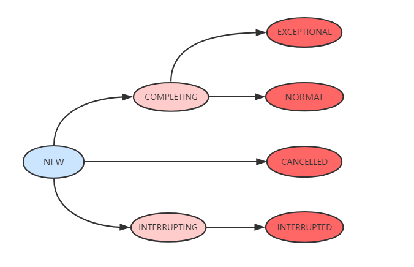

## FutureTask
  
Future 表示了一个任务的生命周期，是一个可取消的异步运算，可以把它看作是一个异步操作的结果的占位符，它将在未来的某个时刻完成，并提供对其结果的访问。在并发包中许多异步任务类都继承自Future，其中最典型的就是 FutureTask。  
FutureTask实现了RunnableFuture接口，而RunnableFuture接口继承了Runnable接口和Future接口，所以FutureTask既能当做一个Runnable直接被Thread执行，
也能得到Callable的计算结果。  

### 重要接口  
* Callable接口  
Callable接口带泛型，且泛型就是call方法的返回类型。 
```java
public interface Callable<V> {
    /**
     * Computes a result, or throws an exception if unable to do so.
     *
     * @return computed result
     * @throws Exception if unable to compute a result
     */
    V call() throws Exception;
}
```  
* Runnable接口  
Runnable没有返回值也不能抛异常。  
```java
@FunctionalInterface
public interface Runnable {
    /**
     * When an object implementing interface <code>Runnable</code> is used
     * to create a thread, starting the thread causes the object's
     * <code>run</code> method to be called in that separately executing
     * thread.
     * <p>
     * The general contract of the method <code>run</code> is that it may
     * take any action whatsoever.
     *
     * @see     java.lang.Thread#run()
     */
    public abstract void run();
}
```  
* Future接口  
Future接口提供的方法可以查看异步执行的结果，查看是否执行完毕，还可以取消执行等。  
```java
public interface Future<V> {
    /**
     * 取消异步任务的执行，
     * @param mayInterruptIfRunning, true/false
     * @return
     */
    boolean cancel(boolean mayInterruptIfRunning);
    boolean isCancelled();
    boolean isDone();

    /**
     * 获取任务执行结果，如果任务还没执行完则会阻塞直到任务执行完毕。
     * @return
     * @throws InterruptedException
     * @throws ExecutionException
     */
    V get() throws InterruptedException, ExecutionException;
    // 可设置阻塞超时时间
    V get(long timeout, TimeUnit unit)
        throws InterruptedException, ExecutionException, TimeoutException;
}
```  
### FutureTask核心属性  
```java

//内部持有的callable任务，运行完毕后置空null
private Callable<V> callable;

//从get()中返回的结果或抛出的异常
private Object outcome; // non-volatile, protected by state reads/writes

//运行callable的线程
private volatile Thread runner;

//使用Treiber栈(一种无锁并发栈，CAS实现)保存等待线程
private volatile WaitNode waiters;

//任务状态
private volatile int state;
private static final int NEW          = 0;
private static final int COMPLETING   = 1;
private static final int NORMAL       = 2;
private static final int EXCEPTIONAL  = 3;
private static final int CANCELLED    = 4;
private static final int INTERRUPTING = 5;
private static final int INTERRUPTED  = 6;
```
任务的七种状态如下：  
* NEW: 新任务/还没执行完的任务，初始状态；  
* COMPLETING: 执行完成/执行时发生异常，但是结果还没有保存到outcome字段时，NEW->COMPLETING。该状态时间很短，是中间状态。  
* NORMAL: 执行完毕且结果已保存到outcome，COMPLETING->NORMAL，终态。  
* EXCEPTIONAL: 执行发生异常且结果已保存到outcome，COMPLETING->EXCEPTIONAL，终态。  
* CANCELLED: 调用了cancel(false)取消任务且不中断任务执行线程，NEW->CANCELLED，终态。  
* INTERRUPTING: 调用了cancel(true)取消任务且中断任务执行线程，但是还没有完成中断，NEW->INTERRUPTING，中间状态。  
* INTERRUPTED: 中断线程执行完成，INTERRUPTING->INTERRUPTED，终态。  
  

### 构造函数  
```java
public FutureTask(Callable<V> callable) {
    if (callable == null)
        throw new NullPointerException();
    this.callable = callable;
    this.state = NEW;       // ensure visibility of callable
}
```
```java
public FutureTask(Runnable runnable, V result) {
    this.callable = Executors.callable(runnable, result);
    this.state = NEW;       // ensure visibility of callable
}
```
Executors.callable把runnable封装成callable，执行完毕返回result，如果不需要结果可以传null。  
```java
public static <T> Callable<T> callable(Runnable task, T result) {
    if (task == null)
       throw new NullPointerException();
    return new RunnableAdapter<T>(task, result);
}
//适配器模式
static final class RunnableAdapter<T> implements Callable<T> {
    final Runnable task;
    final T result;
    RunnableAdapter(Runnable task, T result) {
        this.task = task;
        this.result = result;
    }
    public T call() {
        task.run();
        return result;
    }
}
```
### 核心方法  
#### run()  
```java
public void run() {
    //新建任务，CAS替换runner为当前线程
    if (state != NEW ||
        !UNSAFE.compareAndSwapObject(this, runnerOffset,
                                     null, Thread.currentThread()))
        return;
    try {
        Callable<V> c = callable;
        if (c != null && state == NEW) {
            V result;
            boolean ran;
            try {
                result = c.call();
                ran = true;
            } catch (Throwable ex) {
                result = null;
                ran = false;
                setException(ex);
            }
            if (ran)
                set(result);//设置执行结果
        }
    } finally {
        // runner must be non-null until state is settled to
        // prevent concurrent calls to run()
        runner = null;
        // state must be re-read after nulling runner to prevent
        // leaked interrupts
        int s = state;
        if (s >= INTERRUPTING)
            handlePossibleCancellationInterrupt(s);//处理中断逻辑,设置成INTERRUPTING状态
    }
}
```
运行任务，如果任务状态为NEW状态，则利用CAS修改为当前线程。执行完毕调用set(result)方法设置执行结果。  
```java
protected void set(V v) {
    if (UNSAFE.compareAndSwapInt(this, stateOffset, NEW, COMPLETING)) {
        outcome = v;
        UNSAFE.putOrderedInt(this, stateOffset, NORMAL); // final state
        finishCompletion();//执行完毕，唤醒等待线程
    }
}
```
```java
private void finishCompletion() {
    // assert state > COMPLETING;
    for (WaitNode q; (q = waiters) != null;) {
        if (UNSAFE.compareAndSwapObject(this, waitersOffset, q, null)) {//移除等待线程
            for (;;) {//自旋遍历等待线程
                Thread t = q.thread;
                if (t != null) {
                    q.thread = null;
                    LockSupport.unpark(t);//唤醒等待线程
                }
                WaitNode next = q.next;
                if (next == null)
                    break;
                q.next = null; // unlink to help gc
                q = next;
            }
            break;
        }
    }
    //任务完成后调用函数，自定义扩展
    done();

    callable = null;        // to reduce footprint
}
```
#### get()
```java
//获取执行结果
public V get() throws InterruptedException, ExecutionException {
    int s = state;
    if (s <= COMPLETING)
        s = awaitDone(false, 0L);
    return report(s);
}
```
get方法获取任务执行结果，如果处于COMPLETING/NEW状态，就调用awaitDone方法等待任务完成，完成后调用report方法取得结果/异常。  
```java
//返回执行结果或抛出异常
private V report(int s) throws ExecutionException {
    Object x = outcome;
    if (s == NORMAL)
        return (V)x;
    if (s >= CANCELLED)
        throw new CancellationException();
    throw new ExecutionException((Throwable)x);
}
```
#### awaitDone()  
awaitDone用于等待任务完成，或任务因为中断或超时而终止。返回任务的完成状态。  
```java
private int awaitDone(boolean timed, long nanos)
    throws InterruptedException {
    final long deadline = timed ? System.nanoTime() + nanos : 0L;
    WaitNode q = null;
    boolean queued = false;
    for (;;) {//自旋
        if (Thread.interrupted()) {//获取并清除中断状态
            removeWaiter(q);//移除等待WaitNode
            throw new InterruptedException();
        }

        int s = state;
        //如果是结束状态，置空等待节点的线程，返回状态。
        if (s > COMPLETING) {
            if (q != null)
                q.thread = null;
            return s;
        }
        //如果是COMPLETING，说明马上要完成了，还不能超时，要继续任务。
        else if (s == COMPLETING) // cannot time out yet
            Thread.yield();
        //如果状态是NEW，new WaitNode().
        else if (q == null)
            q = new WaitNode();
        else if (!queued)
            //CAS修改waiter
            queued = UNSAFE.compareAndSwapObject(this, waitersOffset,
                                                 q.next = waiters, q);
        //如果等待超时了，移除等待节点
        else if (timed) {
            nanos = deadline - System.nanoTime();
            if (nanos <= 0L) {
                removeWaiter(q);//超时，移除等待节点
                return state;
            }
            LockSupport.parkNanos(this, nanos);//阻塞当前线程
        }
        //如果等待没有超时
        else
            LockSupport.park(this);//阻塞当前线程
    }
}
```
#### cancel()
尝试取消任务。如果任务已经完成或已经被取消，此操作会失败。  
```java
public boolean cancel(boolean mayInterruptIfRunning) {
    //如果当前Future状态为NEW，根据参数修改Future状态为INTERRUPTING或CANCELLED
    if (!(state == NEW &&
          UNSAFE.compareAndSwapInt(this, stateOffset, NEW,
              mayInterruptIfRunning ? INTERRUPTING : CANCELLED)))
        return false;
    //如果状态不为NEW，判断是否可以再运行时中断，最后移除并唤醒所有等待的线程
    try {    // in case call to interrupt throws exception
        if (mayInterruptIfRunning) {//可以在运行时中断
            try {
                Thread t = runner;
                if (t != null)
                    t.interrupt();
            } finally { // final state
                UNSAFE.putOrderedInt(this, stateOffset, INTERRUPTED);
            }
        }
    } finally {
        finishCompletion();//移除并唤醒所有等待线程
    }
    return true;
}
```


### 示例
* [**FutureTaskDemo1.java**](../main/java/com/example/jucdemo/futuretask/FutureTaskDemo1.java)  
* [**FutureTaskDemo2.java**](../main/java/com/example/jucdemo/futuretask/FutureTaskDemo2.java)


