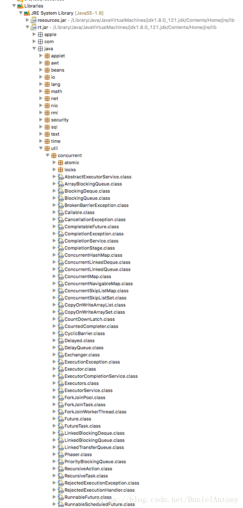
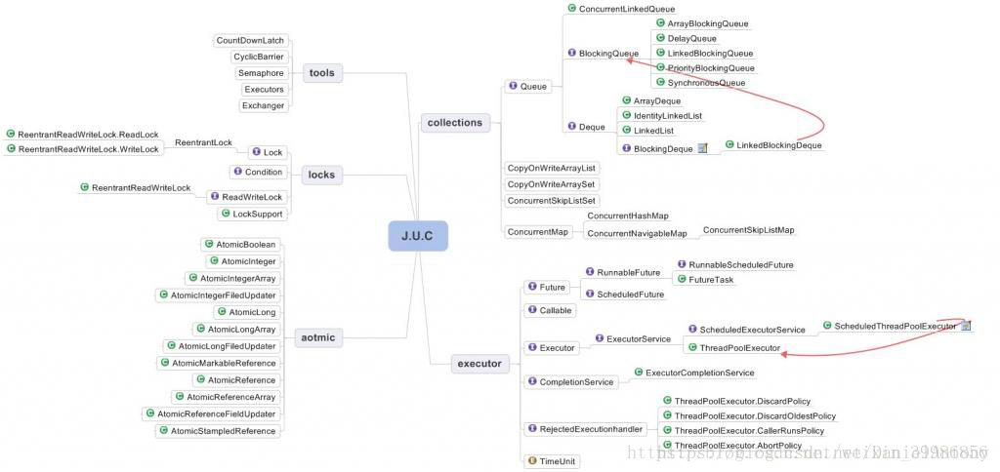
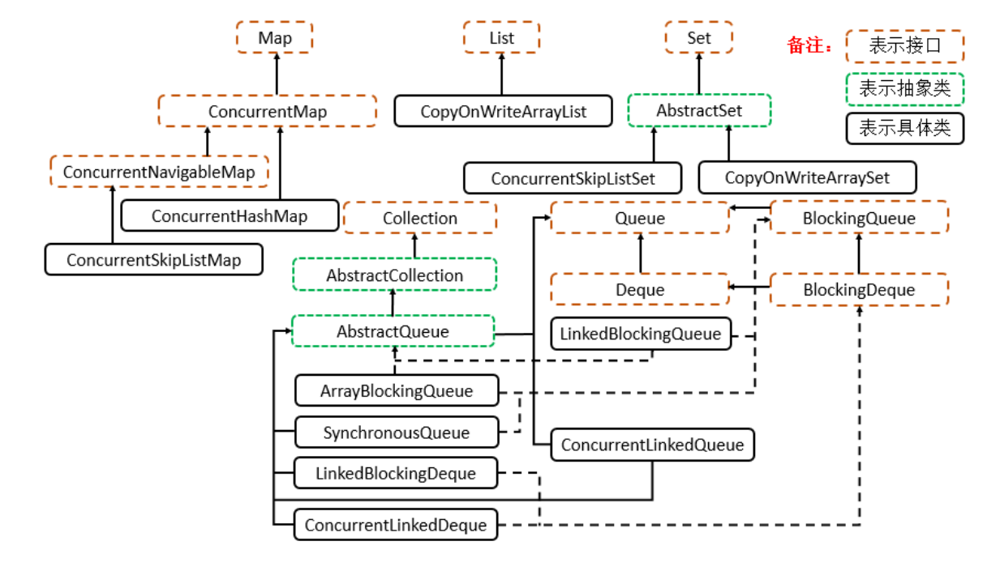

# JUC Demo
--java.util.concurrent

## Tools
* [**CountDownLatch**](../docs/CountDownLatch.md)
* [**CyclicBarrier**](../docs/CyclicBarrier.md)
* [**Semaphore**](../docs/Semaphore.md)
* [**Phaser**](../docs/Phaser.md)
* [**Exchanger**](../docs/Exchanger.md)

## Collections

* [**BlockingQueue**](../docs/BlockingQueue.md)
* [**ConcurrentHashMap**](../docs/ConcurrentHashMap.md)

## Executor

## Atomic