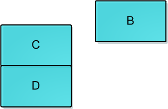

## Atomic
java原子类底层是CAS实现的，而CAS底层是Unsafe类实现的。  
CAS+原子操作实现非阻塞同步。  

### CAS
Compare-And-Swap，让CPU先进行两个值的比较，如果不同则原子地更新某个位置的值。  
CAS是基于硬件的汇编指令实现的，靠的是硬件，JVM封装了这些汇编调用，Atomicxxx也是使用了这些接口。  

### ABA问题
线程1和线程2并发访问ConcurrentStack  
线程1执行出栈【预期结果是弹出A，B成为栈顶】，但在读取栈顶A之后，被线程2抢占  
   
线程2记录栈顶A，依次弹出A和B，再依次将D，C，A入栈，此时B处于游离状态。  
  
此时轮到线程T1执行CAS操作，检测发现栈顶仍为A，所以CAS成功，栈顶变为B，但实际上B.next为null，C D丢了  
  

ABA问题实例 [**AbaDemo1.java**](../main/java/com/example/jucdemo/atomic/AbaDemo1.java)

### UnSafe类
Unsafe主要提供一些用于执行低级别、不安全操作的方法，如直接访问系统内存资源、自主管理内存资源等，
这些方法在提升Java运行效率、增强Java语言底层资源操作能力方面起到了很大的作用。
但由于Unsafe类使Java语言拥有了类似C语言指针一样操作内存空间的能力，这无疑也增加了程序发生相关指针问题的风险。
在程序中过度、不正确使用Unsafe类会使得程序出错的概率变大，使得Java这种安全的语言变得不再“安全”。  
这个类尽管里面的方法都是 public 的，但是并没有办法使用它们，对于 Unsafe 类的使用都是受限制的，只有授信的代码才能获得该类的实例。  
  
```java
public final int getAndAddInt(Object paramObject, long paramLong, int paramInt)
  {
    int i;
    do
      i = getIntVolatile(paramObject, paramLong);
    while (!compareAndSwapInt(paramObject, paramLong, i, i + paramInt));
    return i;
  }

  public final long getAndAddLong(Object paramObject, long paramLong1, long paramLong2)
  {
    long l;
    do
      l = getLongVolatile(paramObject, paramLong1);
    while (!compareAndSwapLong(paramObject, paramLong1, l, l + paramLong2));
    return l;
  }

  public final int getAndSetInt(Object paramObject, long paramLong, int paramInt)
  {
    int i;
    do
      i = getIntVolatile(paramObject, paramLong);
    while (!compareAndSwapInt(paramObject, paramLong, i, paramInt));
    return i;
  }

  public final long getAndSetLong(Object paramObject, long paramLong1, long paramLong2)
  {
    long l;
    do
      l = getLongVolatile(paramObject, paramLong1);
    while (!compareAndSwapLong(paramObject, paramLong1, l, paramLong2));
    return l;
  }

  public final Object getAndSetObject(Object paramObject1, long paramLong, Object paramObject2)
  {
    Object localObject;
    do
      localObject = getObjectVolatile(paramObject1, paramLong);
    while (!compareAndSwapObject(paramObject1, paramLong, localObject, paramObject2));
    return localObject;
  }
```
内部使用while循环进行CAS操作，如果更新失败继续尝试。  
Unsafe类只提供三种CAS方法,其他方法都是在此基础上的封装：  
```java
public final native boolean compareAndSwapObject(Object paramObject1, long paramLong, Object paramObject2, Object paramObject3);

public final native boolean compareAndSwapInt(Object paramObject, long paramLong, int paramInt1, int paramInt2);

public final native boolean compareAndSwapLong(Object paramObject, long paramLong1, long paramLong2, long paramLong3);
```
compareAndSwapInt的底层实现是在unsafe.cpp中。  
```java
UNSAFE_ENTRY(jboolean, Unsafe_CompareAndSwapInt(JNIEnv *env, jobject unsafe, jobject obj, jlong offset, jint e, jint x))
  UnsafeWrapper("Unsafe_CompareAndSwapInt");
  oop p = JNIHandles::resolve(obj);
  jint* addr = (jint *) index_oop_from_field_offset_long(p, offset);
  return (jint)(Atomic::cmpxchg(x, addr, e)) == e;
UNSAFE_END
```
可以看到它通过 Atomic::cmpxchg 来实现比较和替换操作。其中参数x是即将更新的值，参数e是原内存的值。    
如果是Linux的x86，Atomic::cmpxchg方法的实现如下：  
```java
inline jint Atomic::cmpxchg (jint exchange_value, volatile jint* dest, jint compare_value) {
  int mp = os::is_MP(); //判断是否是多处理器
  __asm__ volatile (LOCK_IF_MP(%4) "cmpxchgl %1,(%3)"
                    : "=a" (exchange_value)
                    : "r" (exchange_value), "a" (compare_value), "r" (dest), "r" (mp)
                    : "cc", "memory");
  return exchange_value;
}
```
翻译一下：  
> cmpxchg(void* ptr, int old, int new)，如果ptr和old的值一样，则把new写到ptr内存，否则返回ptr的值，整个操作是原子的。  

```java
//获取给定的 paramField 的内存地址偏移量
public native long staticFieldOffset(Field paramField);
//获取数组第一个元素的偏移地址
public native int arrayBaseOffset(Class paramClass);
//分配内存
public native long allocateMemory(long paramLong);
//扩充内存
public native long reallocateMemory(long paramLong1, long paramLong2);
//释放内存
public native void freeMemory(long paramLong);
```
### 以AtomicInteger为例

常用API：  
```java
public final int get(); //获取当前的值
public final int getAndSet(int newValue); //获取当前的值,并设置新的值
public final int getAndIncrement(); //获取当前的值,并自增
public final int getAndDecrement(); //获取当前的值,并自减
public final int getAndAdd(int delta); //获取当前的值,并加上预期的值
void lazySet(int newValue);  //最终会设置成newValue,使用lazySet设置值后，可能导致其他线程在之后的一小段时间内还是可以读到旧的值。
```

在不适用原子操作的时候我们会加锁。
```java
public class Test {
    private int i=0;
    public synchronized int add(){
        return i++;
    }
}
```

使用AtomicInteger原子操作。
```java
public class Test {
    private  AtomicInteger i = new AtomicInteger(0);
    public int add(){
        return i.addAndGet(1);
    }
}
```
上源码：  
```java
public class AtomicInteger extends Number implements java.io.Serializable {
    private static final Unsafe unsafe = Unsafe.getUnsafe();
    private static final long valueOffset;
    static {
        try {
            //用于获取value字段相对当前对象的“起始地址”的偏移量
            valueOffset = unsafe.objectFieldOffset(AtomicInteger.class.getDeclaredField("value"));
        } catch (Exception ex) { throw new Error(ex); }
    }

    private volatile int value;

    //返回当前值
    public final int get() {
        return value;
    }

    /**
     * Atomically adds the given value to the current value.
     *
     * @param delta the value to add
     * @return the previous value
     */
    public final int getAndAdd(int delta) {
        //三个参数，1、当前的实例 2、value实例变量的偏移量 3、当前value要加上的数(delta)。
        return unsafe.getAndAddInt(this, valueOffset, delta);
    }

    //递增加1
    public final int incrementAndGet() {
        return unsafe.getAndAddInt(this, valueOffset, 1) + 1;
    }

    /**
     * Atomically adds the given value to the current value.
     *
     * @param delta the value to add
     * @return the updated value
     */
    public final int addAndGet(int delta) {
        return unsafe.getAndAddInt(this, valueOffset, delta) + delta;
    }
...
}
```
AtomicInteger 底层用的是volatile的变量和CAS来进行更改数据的。  

### 原子类
* 原子类的基本类型 3个  
* AtomicBoolean, AtomicInteger, AtomicLong.  
以上三个方法几乎一模一样，参考AtomicInteger.
  
* 原子更新数组  
通过原子的方式更新数组里的某个元素。  
    * AtomicIntegerArray;
    * AtomicLongArray;  
    * AtomicReferenceArray: 原子更新引用类型数组;  
主要方法：  
    * get(int index): 获取索引的元素值; 
    * getAndAdd(int i, int delta): 获取i的值，并加上delta;
    * compareAndSet(int i, E expect, E update);  
举个栗子：* [**AtomicIntegerArray.java**](../main/java/com/example/jucdemo/atomic/AtomicIntegerArrayDemo.java)   

* 原子更新引用类型  
  * AtomicReference: 原子更新引用类型。  
  * AtomicStampedReference: 原子更新引用类型, 内部使用Pair来存储元素值及其版本号。  
  * AtomicMarkableReferce: 原子更新带有标记位的引用类型。  

这三个类提供的方法都差不多，首先构造一个引用对象，然后把引用对象set进Atomic类，然后调用compareAndSet等一些方法去进行原子操作，原理都是基于Unsafe实现，但AtomicReferenceFieldUpdater略有不同，更新的字段必须用volatile修饰。  
举个栗子：* [**AtomicReference.java**](../main/java/com/example/jucdemo/atomic/AtomicReferenceDemo.java)

* 原子更新Field类  
  * AtomicIntegerFieldUpdater  
  * AtomicLongFieldUpdater  
  * AtomicStampedFieldUpdater  
  * AtomicReferenceFieldUpdater  
都是基于反射。  
对于AtomicIntegerFieldUpdater 的使用稍微有一些限制和约束，约束如下   
  * 字段必须是volatile类型的，在线程之间共享变量时保证立即可见.eg:volatile int value = 3  
  * 字段的描述类型(修饰符public/protected/default/private)是与调用者与操作对象字段的关系一致。也就是说调用者能够直接操作对象字段，那么就可以反射进行原子操作。但是对于父类的字段，子类是不能直接操作的，尽管子类可以访问父类的字段  
  * 只能是实例变量，不能是类变量，也就是说不能加static关键字  
  * 只能是可修改变量，不能使final变量，因为final的语义就是不可修改。实际上final的语义和volatile是有冲突的，这两个关键字不能同时存在  
  * 对于AtomicIntegerFieldUpdater和AtomicLongFieldUpdater只能修改int/long类型的字段，不能修改其包装类型(Integer/Long)。如果要修改包装类型就需要使用AtomicReferenceFieldUpdater  

举个栗子：* [**AtomicIntegerField.java**](../main/java/com/example/jucdemo/atomic/AtomicIntegerFieldDemo.java)    


### 示例
* [**AbaDemo1.java**](../main/java/com/example/jucdemo/atomic/AbaDemo1.java)


