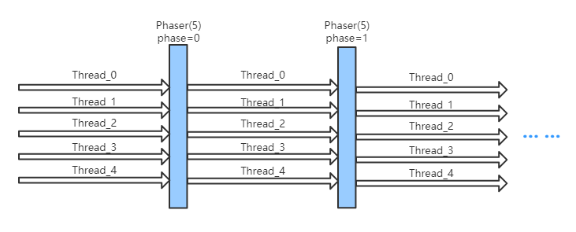

## Phaser

Phaser是JDK 7新增的一个同步辅助类，它可以实现CyclicBarrier和CountDownLatch类似的功能，而且它支持对任务的动态调整。
任务分为多个阶段，每个阶段可以有不同多个线程，线程可随时注册参与不同的阶段。

  
在CyclicBarrier、CountDownLatch中，我们使用计数器来控制程序的顺序执行，同样的在Phaser中也是通过计数器来控制。在Phaser中计数器叫做parties， 我们可以通过Phaser的构造函数或者register()方法来注册。

通过调用register()方法，我们可以动态的控制phaser的个数。如果我们需要取消注册，则可以调用arriveAndDeregister()方法。
Phaser中的arrive()、arriveAndDeregister()方法，这两个方法不会阻塞，但是会返回相应的phase数字，当此phase中最后一个party也arrive以后，phase数字将会增加，即phase进入下一个周期，同时触发（onAdvance）那些阻塞在上一phase的线程。这一点类似于CyclicBarrier的barrier到达机制；更灵活的是，我们可以通过重写onAdvance方法来实现更多的触发行为。

### 方法列表

```java
//构造方法
public Phaser() {
        this(null, 0);
        }
public Phaser(int parties) {
        this(null, parties);
        }
public Phaser(Phaser parent) {
        this(parent, 0);
        }
public Phaser(Phaser parent, int parties)
//注册一个新的party
public int register()
//批量注册
public int bulkRegister(int parties)
//使当前线程到达phaser，不等待其他任务到达。返回arrival phase number
public int arrive()
//使当前线程到达phaser并撤销注册，返回arrival phase number
public int arriveAndDeregister()
/*
 * 使当前线程到达phaser并等待其他任务到达，等价于awaitAdvance(arrive())。
 * 如果需要等待中断或超时，可以使用awaitAdvance方法完成一个类似的构造。
 * 如果需要在到达后取消注册，可以使用awaitAdvance(arriveAndDeregister())。
 */
public int arriveAndAwaitAdvance()
//等待给定phase数，返回下一个 arrival phase number
public int awaitAdvance(int phase)
//阻塞等待，直到phase前进到下一代，返回下一代的phase number
public int awaitAdvance(int phase)
//响应中断版awaitAdvance
public int awaitAdvanceInterruptibly(int phase) throws InterruptedException
public int awaitAdvanceInterruptibly(int phase, long timeout, TimeUnit unit)
        throws InterruptedException, TimeoutException
//使当前phaser进入终止状态，已注册的parties不受影响，如果是分层结构，则终止所有phaser
public void forceTermination()

```


### 示例
* [**PhaserConsumer.java**](../main/java/com/example/jucdemo/phaser/PhaserConsumer.java)


