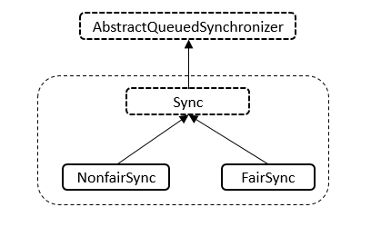

## Semaphore
Semaphore(计数信号量)底层是基于AQS来实现的。  
可以用来控制资源的并发访问数量（限流）。  
理解：公共停车场入口的剩余车位显示屏。车位数量有限，同时只能容纳多少台车，车位满了之后只有等里面的车离开停车场外面的车才可以进入。

### 内部类

* Sync
```java
// 内部类，继承自AQS
abstract static class Sync extends AbstractQueuedSynchronizer {
    // 版本号
    private static final long serialVersionUID = 1192457210091910933L;

    // 构造函数
    Sync(int permits) {
        // 设置状态数
        setState(permits);
    }

    // 获取许可
    final int getPermits() {
        return getState();
    }

    // 共享模式下非公平策略获取
    final int nonfairTryAcquireShared(int acquires) {
        for (;;) { // 无限循环
            // 获取许可数
            int available = getState();
            // 剩余的许可
            int remaining = available - acquires;
            if (remaining < 0 ||
                    compareAndSetState(available, remaining)) // 许可小于0或者比较并且设置状态成功
                return remaining;
        }
    }

    // 共享模式下进行释放
    protected final boolean tryReleaseShared(int releases) {
        for (;;) { // 无限循环
            // 获取许可
            int current = getState();
            // 可用的许可
            int next = current + releases;
            if (next < current) // overflow
                throw new Error("Maximum permit count exceeded");
            if (compareAndSetState(current, next)) // 比较并进行设置成功
                return true;
        }
    }

    // 根据指定的缩减量减小可用许可的数目
    final void reducePermits(int reductions) {
        for (;;) { // 无限循环
            // 获取许可
            int current = getState();
            // 可用的许可
            int next = current - reductions;
            if (next > current) // underflow
                throw new Error("Permit count underflow");
            if (compareAndSetState(current, next)) // 比较并进行设置成功
                return;
        }
    }

    // 获取并返回立即可用的所有许可
    final int drainPermits() {
        for (;;) { // 无限循环
            // 获取许可
            int current = getState();
            if (current == 0 || compareAndSetState(current, 0)) // 许可为0或者比较并设置成功
                return current;
        }
    }
}
```
* NonfairSync
```java
static final class NonfairSync extends Sync {
    // 版本号
    private static final long serialVersionUID = -2694183684443567898L;
    
    // 构造函数
    NonfairSync(int permits) {
        super(permits);
    }
    // 共享模式下获取
    protected int tryAcquireShared(int acquires) {
        return nonfairTryAcquireShared(acquires);
    }
}
```
*FairSync
```java
static final class FairSync extends Sync {
    private static final long serialVersionUID = 2014338818796000944L;

    FairSync(int permits) {
        super(permits);
    }

    protected int tryAcquireShared(int acquires) {
        for (; ; ) { // 无限循环
            if (hasQueuedPredecessors()) // 同步队列中存在其他节点，AQS
                return -1;
            // 获取许可
            int available = getState();
            // 剩余的许可
            int remaining = available - acquires;
            if (remaining < 0 ||
                    compareAndSetState(available, remaining)) // 剩余的许可小于0或者比较设置成功
                return remaining;
        }
    }
}
```
### 核心方法  
* acquire()  
  从信号量获取一个(多个)许可，在提供一个许可前一直将线程阻塞，或者线程被中断
```java
    public void acquire() throws InterruptedException {
        sync.acquireSharedInterruptibly(1);
    }
    public void acquire(int permits) throws InterruptedException {
        if (permits < 0) throw new IllegalArgumentException();
        sync.acquireSharedInterruptibly(permits);
    }
    
```
* release()  
  释放一个(多个)许可，将其返回给信号量
```java
    public void release() {
        sync.releaseShared(1);
    }
    public void release(int permits) {
        if(permits< 0)throw new IllegalArgumentException();
        sync.releaseShared(permits);
    }
```

### 示例
* [**SemaphoreConsumer.java**](../main/java/com/example/jucdemo/semaphore/SemaphoreConsumer.java)


