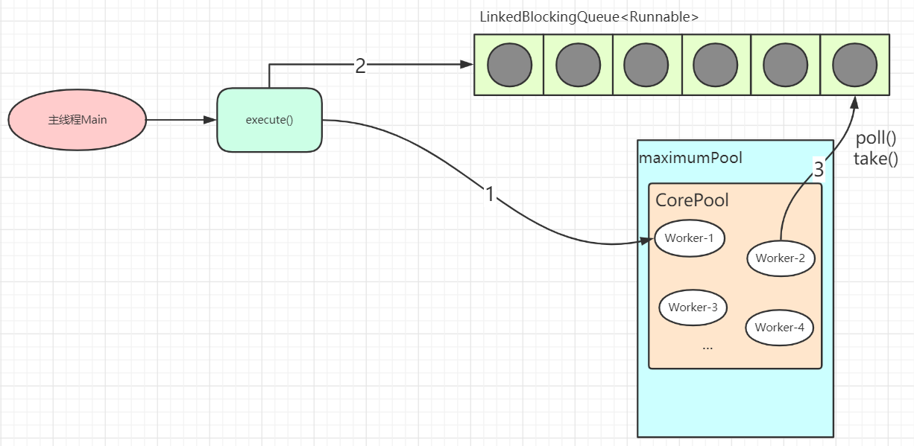

## ThreadPoolExecutor
Java是如何实现和管理线程池的？分为工作单元和执行机制。工作单元包括Runnable和Callable，执行机制由Executor框架提供。  

### ThreadPoolExecutor原理  
一个线程集合workerSet，其中一个个工作线程是worker；  
一个阻塞队列workQueue；   
用户向线程池中提交任务，线程池会先将任务放入workQueue中，workerSet中的线程会不断的从workQueue中获取线程执行。  
当workQueue中没有任务的时候，worker就会阻塞，知道有了新的任务。  

### 关键属性
```java
//存放任务的阻塞队列
private final BlockingQueue<Runnable> workQueue;
//worker的集合,用set来存放
private final HashSet<Worker> workers = new HashSet<Worker>();
//历史达到的worker数最大值
private int largestPoolSize;
//当队列满了并且worker的数量达到maxSize的时候,执行具体的拒绝策略
private volatile RejectedExecutionHandler handler;
//超出coreSize的worker的生存时间
private volatile long keepAliveTime;
//常驻worker的数量
private volatile int corePoolSize;
//最大worker的数量,一般当workQueue满了才会用到这个参数
private volatile int maximumPoolSize;
```
### 内部状态
```java
//这个属性是用来存放 当前运行的worker数量以及线程池状态的
//int是32位的，这里把int的高3位拿来充当线程池状态的标志位,后29位拿来充当当前运行worker的数量
private final AtomicInteger ctl = new AtomicInteger(ctlOf(RUNNING, 0));
private static final int COUNT_BITS = Integer.SIZE - 3; //32-3
private static final int CAPACITY   = (1 << COUNT_BITS) - 1;

// runState is stored in the high-order bits
private static final int RUNNING    = -1 << COUNT_BITS;
private static final int SHUTDOWN   =  0 << COUNT_BITS;
private static final int STOP       =  1 << COUNT_BITS;
private static final int TIDYING    =  2 << COUNT_BITS;
private static final int TERMINATED =  3 << COUNT_BITS;

// Packing and unpacking ctl
private static int runStateOf(int c)     { return c & ~CAPACITY; }
private static int workerCountOf(int c)  { return c & CAPACITY; }
private static int ctlOf(int rs, int wc) { return rs | wc; }
```
RUNNING: -1 << COUNT_BITS，即高3位为111，该状态的线程池会接收新任务，并处理阻塞队列中的任务；  
SHUTDOWN:  0 << COUNT_BITS，即高3位为000，该状态的线程池不会接收新任务，但会处理阻塞队列中的任务；   
STOP :  1 << COUNT_BITS，即高3位为001，该状态的线程不会接收新任务，也不会处理阻塞队列中的任务，而且会中断正在运行的任务；   
TIDYING :  2 << COUNT_BITS，即高3位为010, 所有的任务都已经终止；   
TERMINATED:  3 << COUNT_BITS，即高3位为011, terminated()方法已经执行完成；  
  
### 执行任务
#### execute()  
```java
public void execute(Runnable command) {
    if (command == null)
        throw new NullPointerException();
    /*
     * Proceed in 3 steps:
     *
     * 1. If fewer than corePoolSize threads are running, try to
     * start a new thread with the given command as its first
     * task.  The call to addWorker atomically checks runState and
     * workerCount, and so prevents false alarms that would add
     * threads when it shouldn't, by returning false.
     *
     * 2. If a task can be successfully queued, then we still need
     * to double-check whether we should have added a thread
     * (because existing ones died since last checking) or that
     * the pool shut down since entry into this method. So we
     * recheck state and if necessary roll back the enqueuing if
     * stopped, or start a new thread if there are none.
     *
     * 3. If we cannot queue task, then we try to add a new
     * thread.  If it fails, we know we are shut down or saturated
     * and so reject the task.
     */
    int c = ctl.get();
    if (workerCountOf(c) < corePoolSize) {  
    //workerCountOf获取线程池的当前线程数；小于corePoolSize，执行addWorker创建新线程执行command任务
       if (addWorker(command, true))
            return;
        c = ctl.get();
    }
    // double check: c, recheck
    // 线程池处于RUNNING状态，把提交的任务成功放入阻塞队列中
    if (isRunning(c) && workQueue.offer(command)) {
        int recheck = ctl.get();
        //如果线程池没有RUNNING，成功从阻塞队列中删除任务，执行reject方法处理任务
        if (! isRunning(recheck) && remove(command))
            reject(command);
        //线程池处于running状态，但是没有线程，则创建线程
        else if (workerCountOf(recheck) == 0)
            addWorker(null, false);
    }
    // 往线程池中创建新的线程失败，则reject任务
    else if (!addWorker(command, false))
        reject(command);
}
```
* 为什么需要double check线程池的状态?  
  在多线程环境下，线程池的状态时刻在变化，而ctl.get()是非原子操作，很有可能刚获取了线程池状态后线程池状态就改变了。判断是否将command加入workque是线程池之前的状态。倘若没有double check，万一线程池处于非running状态(在多线程环境下很有可能发生)，那么command永远不会执行。  
#### addWorker()  
addWorker主要负责创建新的线程并执行任务 线程池创建新线程执行任务时，需要获取全局锁.  
```java
private final ReentrantLock mainLock = new ReentrantLock();

private boolean addWorker(Runnable firstTask, boolean core) {
    // CAS更新线程池数量
    retry:
    for (;;) {
        int c = ctl.get();
        int rs = runStateOf(c);

        // Check if queue empty only if necessary.
        if (rs >= SHUTDOWN &&
            ! (rs == SHUTDOWN &&
                firstTask == null &&
                ! workQueue.isEmpty()))
            return false;

        for (;;) {
            int wc = workerCountOf(c);
            if (wc >= CAPACITY ||
                wc >= (core ? corePoolSize : maximumPoolSize))
                return false;
            if (compareAndIncrementWorkerCount(c))
                break retry;
            c = ctl.get();  // Re-read ctl
            if (runStateOf(c) != rs)
                continue retry;
            // else CAS failed due to workerCount change; retry inner loop
        }
    }

    boolean workerStarted = false;
    boolean workerAdded = false;
    Worker w = null;
    try {
        w = new Worker(firstTask);
        final Thread t = w.thread;
        if (t != null) {
            // 线程池重入锁
            final ReentrantLock mainLock = this.mainLock;
            mainLock.lock();
            try {
                // Recheck while holding lock.
                // Back out on ThreadFactory failure or if
                // shut down before lock acquired.
                int rs = runStateOf(ctl.get());

                if (rs < SHUTDOWN ||
                    (rs == SHUTDOWN && firstTask == null)) {
                    if (t.isAlive()) // precheck that t is startable
                        throw new IllegalThreadStateException();
                    workers.add(w);
                    int s = workers.size();
                    if (s > largestPoolSize)
                        largestPoolSize = s;
                    workerAdded = true;
                }
            } finally {
                mainLock.unlock();
            }
            if (workerAdded) {
                t.start();  // 线程启动，执行任务(Worker.thread(firstTask).start());
                workerStarted = true;
            }
        }
    } finally {
        if (! workerStarted)
            addWorkerFailed(w);
    }
    return workerStarted;
}
```
#### Worker类  
* 继承了AQS类，可以方便的实现工作线程的中止操作；  
* 实现了Runnable接口，可以将自身作为一个任务在工作线程中执行；  
* 当前提交的任务firstTask作为参数传入Worker的构造方法；  

```java
 private final class Worker extends AbstractQueuedSynchronizer implements Runnable{
     Worker(Runnable firstTask) {
         setState(-1); // inhibit interrupts until runWorker
         this.firstTask = firstTask;
         this.thread = getThreadFactory().newThread(this); // 创建线程
     }
     /** Delegates main run loop to outer runWorker  */
     public void run() {
         runWorker(this);
     }
     // ...
 }
```
* 属性&构造方法  
```java
//运行的线程,前面addWorker方法中就是直接通过启动这个线程来启动这个worker
final Thread thread;
//当一个worker刚创建的时候,就先尝试执行这个任务
Runnable firstTask;
//记录完成任务的数量
volatile long completedTasks;

Worker(Runnable firstTask) {
    setState(-1); // inhibit interrupts until runWorker
    this.firstTask = firstTask;
    //创建一个Thread,将自己设置给他,后面这个thread启动的时候,也就是执行worker的run方法
    this.thread = getThreadFactory().newThread(this);
}   
```
#### runWorker()-线程池的核心方法  
```java
final void runWorker(Worker w) {
    Thread wt = Thread.currentThread();
    Runnable task = w.firstTask;
    w.firstTask = null;
    // 线程启动之后，通过unlock方法释放锁，设置AQS的state为0，表示运行可中断；
    w.unlock(); // allow interrupts
    boolean completedAbruptly = true;
    try {
        // 先执行firstTask，再从workerQueue中取task(getTask())
        // 通过getTask方法从阻塞队列中获取等待的任务，如果队列中没有任务，getTask方法会被阻塞并挂起，不会占用cpu资源；
        while (task != null || (task = getTask()) != null) {
            //进行加锁操作，保证thread不被其他线程中断(除非线程池被中断)
            w.lock();
            // If pool is stopping, ensure thread is interrupted;
            // if not, ensure thread is not interrupted.  This
            // requires a recheck in second case to deal with
            // shutdownNow race while clearing interrupt
            //检查线程池状态，倘若线程池处于中断状态，当前线程将中断。
            if ((runStateAtLeast(ctl.get(), STOP) ||
                    (Thread.interrupted() &&
                    runStateAtLeast(ctl.get(), STOP))) &&
                !wt.isInterrupted())
                wt.interrupt();
            try {
                //执行beforeExecute
                beforeExecute(wt, task);
                Throwable thrown = null;
                try {
                    //执行任务的run方法
                    task.run();
                } catch (RuntimeException x) {
                    thrown = x; throw x;
                } catch (Error x) {
                    thrown = x; throw x;
                } catch (Throwable x) {
                    thrown = x; throw new Error(x);
                } finally {
                    //执行afterExecute方法
                    afterExecute(task, thrown);
                }
            } finally {
                task = null;
                w.completedTasks++;
                //解锁操作
                w.unlock();
            }
        }
        completedAbruptly = false;
    } finally {
        processWorkerExit(w, completedAbruptly);
    }
}
```
#### getTask()
```java
private Runnable getTask() {
    boolean timedOut = false; // Did the last poll() time out?

    for (;;) {
        int c = ctl.get();
        int rs = runStateOf(c);

        // Check if queue empty only if necessary.
        if (rs >= SHUTDOWN && (rs >= STOP || workQueue.isEmpty())) {
            decrementWorkerCount();
            return null;
        }

        int wc = workerCountOf(c);

        // Are workers subject to culling?
        // allowCoreThreadTimeOut为false，线程即使空闲也不会被销毁；倘若为ture，在keepAliveTime内仍空闲则会被销毁。
        boolean timed = allowCoreThreadTimeOut || wc > corePoolSize;

        if ((wc > maximumPoolSize || (timed && timedOut))
            && (wc > 1 || workQueue.isEmpty())) {
            if (compareAndDecrementWorkerCount(c))
                return null;
            continue;
        }

        //如果线程允许空闲等待而不被销毁timed == false，workQueue.take任务: 如果阻塞队列为空，当前线程会被挂起等待；当队列中有任务加入时，线程被唤醒，take方法返回任务，并执行；
        //如果线程不允许无休止空闲timed == true, workQueue.poll任务: 如果在keepAliveTime时间内，阻塞队列还是没有任务，则返回null；
        try {
            Runnable r = timed ?
                workQueue.poll(keepAliveTime, TimeUnit.NANOSECONDS) :
                workQueue.take();
            if (r != null)
                return r;
            timedOut = true;
        } catch (InterruptedException retry) {
            timedOut = false;
        }
    }
}
```
* 总结  
> execute –> addWorker –>runworker (getTask)  
 
线程池的工作线程通过Woker类实现，在ReentrantLock锁的保证下，把Woker实例插入到HashSet后，并启动Woker中的线程。
从Woker类的构造方法实现可以发现: 线程工厂在创建线程thread时，将Woker实例本身this作为参数传入，当执行start方法启动线程thread时，本质是执行了runWorker方法。
firstTask执行完成之后，通过getTask方法从阻塞队列中获取等待的任务，如果队列中没有任务，getTask方法会被阻塞并挂起，不会占用cpu资源；



### 初始化
当一个任务提交至线程池之后:   
1. 线程池首先当前运行的线程数量是否少于corePoolSize。如果是，则创建一个新的工作线程来执行任务。如果都在执行任务，则进入2.   
2. 判断BlockingQueue是否已经满了，倘若还没有满，则将线程放入BlockingQueue。否则进入3.   
3. 如果创建一个新的工作线程将使当前运行的线程数量超过maximumPoolSize，则交给RejectedExecutionHandler来处理任务。  
```java
public ThreadPoolExecutor(int corePoolSize,
                              int maximumPoolSize,
                              long keepAliveTime,
                              TimeUnit unit,
                              BlockingQueue<Runnable> workQueue,
                              RejectedExecutionHandler handler)
```
####参数解释  
* corePoolSize: 线程池核心线程数，每提交一个任务，线程池创建一个新任务，直到当前线程数等于corePoolSize，后续再提交的任务被保存到阻塞队列中。
如果执行了线程池的prestartAllCoreThreads(),线程池会提前创建并启动所有核心线程。  
* workQueue: 任务的阻塞队列，参考* [**BlockingQueue**](../docs/BlockingQueue.md)
* maximumPoolSize: 线程池最大线程数，如果当前阻塞队列满了，且继续提交任务，则创建新的线程执行任务，前提是当前线程数小于maximumPoolSize；当阻塞队列是无界队列, 则maximumPoolSize则不起作用, 因为无法提交至核心线程池的线程会一直持续地放入workQueue。  
* keepAliveTime: 线程空闲时的存活时间。  
* unit: keepAliveTime的单位。  
* threadFactory: 创建线程的工厂，可自定义线程工厂，默认为DefaultThreadFactory。  
* handler: 线程池饱和策略，当阻塞队列满了，如果继续提交任务，必须采取一种策略处理额外的任务，线程池提供了四种策略：  
    * AbortPolicy: 直接抛异常，默认策略；  
    * CallerRunsPolicy: 用调用者所在的线程来执行任务；  
    * DiscardOldestPolicy: 丢弃阻塞队列中最老的任务，并执行当前任务；  
    * DiscardPolicy: 直接丢弃该任务；  
 也可以实现RejectedExecutionHandler接口，自定义饱和策略，如记日志/持久化等。  

####ThreadPoolExecutor的四种封装
* newFixedThreadPool  
```java
public static ExecutorService newFixedThreadPool(int nThreads) {
    return new ThreadPoolExecutor(nThreads, nThreads,
                                0L, TimeUnit.MILLISECONDS,
                                new LinkedBlockingQueue<Runnable>());
}
```
线程池的线程数量达corePoolSize后，即使线程池没有可执行任务时，也不会释放线程。  
FixedThreadPool的工作队列为无界队列LinkedBlockingQueue(队列容量为Integer.MAX_VALUE), 这会导致以下问题:  
* 线程池里的线程数量不超过corePoolSize,这导致了maximumPoolSize和keepAliveTime将会是个无用参数;  
* 饱和策略失效；  

* newSingleThreadExecutor  
```java
public static ExecutorService newSingleThreadExecutor() {
    return new FinalizableDelegatedExecutorService
        (new ThreadPoolExecutor(1, 1,
                                0L, TimeUnit.MILLISECONDS,
                                new LinkedBlockingQueue<Runnable>()));
}
```
初始化的线程池中只有一个线程，如果该线程异常结束，会重新创建一个新的线程继续执行任务，唯一的线程可以保证所提交任务的顺序执行.  
同样适用LinkedBlockingQueue,饱和策略失效；  

* newCachedThreadPool  
```java
public static ExecutorService newCachedThreadPool() {
    return new ThreadPoolExecutor(0, Integer.MAX_VALUE,
                                    60L, TimeUnit.SECONDS,
                                    new SynchronousQueue<Runnable>());
}
```
线程池取值范围0-Integer.MAX_VALUE(2147483647)；  
使用SynchronousQueue为阻塞队列(就存一个)；  
在没有任务执行时，线程超过keepAliveTime自动释放资源；  
如果没有空闲线程则自动创建线程执行任务，会导致一定的系统开销；  

* newScheduledThreadPool  
```java
public static ScheduledExecutorService newScheduledThreadPool(int corePoolSize) {
        return new ScheduledThreadPoolExecutor(corePoolSize);
    }
public ScheduledThreadPoolExecutor(int corePoolSize) {
        super(corePoolSize, Integer.MAX_VALUE, 0, NANOSECONDS,
        new DelayedWorkQueue());
        }
public ThreadPoolExecutor(int corePoolSize,
        int maximumPoolSize,
        long keepAliveTime,
        TimeUnit unit,
        BlockingQueue<Runnable> workQueue) {
        this(corePoolSize, maximumPoolSize, keepAliveTime, unit, workQueue,
        Executors.defaultThreadFactory(), defaultHandler);
        }        
```
使用DelayedWorkQueue(无界延迟队列)来存储；  
由于 ScheduledThreadPoolExecutor 是一个固定核心线程数大小的线程池，并且使用了一个无界队列，所以调整maximumPoolSize对其没有任何影响；  


####线程池关闭  
遍历线程池中的所有线程，然后逐个调用线程的interrupt方法来中断线程.  
* shutdown()  
  将线程池里的线程状态设置成SHUTDOWN状态， 然后中断所有没有正在执行任务的线程，然后会将剩余的任务全部执行完  
```java
public void shutdown() {
    final ReentrantLock mainLock = this.mainLock;
    mainLock.lock();
    try {
        //检查是否可以关闭线程
        checkShutdownAccess();
        //设置线程池状态
        advanceRunState(SHUTDOWN);
        //尝试中断worker
        interruptIdleWorkers();
            //预留方法,留给子类实现
        onShutdown(); // hook for ScheduledThreadPoolExecutor
    } finally {
        mainLock.unlock();
    }
    tryTerminate();
}

private void interruptIdleWorkers() {
    interruptIdleWorkers(false);
}

private void interruptIdleWorkers(boolean onlyOne) {
    final ReentrantLock mainLock = this.mainLock;
    mainLock.lock();
    try {
        //遍历所有的worker
        for (Worker w : workers) {
            Thread t = w.thread;
            //先尝试调用w.tryLock(),如果获取到锁,就说明worker是空闲的,就可以直接中断它
            //注意的是,worker自己本身实现了AQS同步框架,然后实现的类似锁的功能
            //它实现的锁是不可重入的,所以如果worker在执行任务的时候,会先进行加锁,这里tryLock()就会返回false
            if (!t.isInterrupted() && w.tryLock()) {
                try {
                    t.interrupt();
                } catch (SecurityException ignore) {
                } finally {
                    w.unlock();
                }
            }
            if (onlyOne)
                break;
        }
    } finally {
        mainLock.unlock();
    }
}
```
* shutdownNow()  
  将线程池里的线程状态设置成STOP状态, 然后停止所有正在执行或暂停任务的线程.(然后拒绝所有提交的任务。最后中断左右正在运行中的worker,然后清空任务队列。)  
```java
public List<Runnable> shutdownNow() {
    List<Runnable> tasks;
    final ReentrantLock mainLock = this.mainLock;
    mainLock.lock();
    try {
        checkShutdownAccess();
        //检测权限
        advanceRunState(STOP);
        //中断所有的worker
        interruptWorkers();
        //清空任务队列
        tasks = drainQueue();
    } finally {
        mainLock.unlock();
    }
    tryTerminate();
    return tasks;
}

private void interruptWorkers() {
    final ReentrantLock mainLock = this.mainLock;
    mainLock.lock();
    try {
        //遍历所有worker，然后调用中断方法
        for (Worker w : workers)
            w.interruptIfStarted();
    } finally {
        mainLock.unlock();
    }
}
```  
  只要调用这两个关闭方法中的任意一个, isShutDown() 返回true.
  当所有任务都成功关闭了, isTerminated()返回true

### 配置线程池的因素
从任务的优先级，任务的执行时间长短，任务的性质(CPU密集/ IO密集)，任务的依赖关系这四个角度来分析。并且近可能地使用有界的工作队列。  
* CPU密集型: 尽可能少的线程，Ncpu+1  
* IO密集型: 尽可能多的线程, Ncpu*2，比如数据库连接池  
* 混合型: CPU密集型的任务与IO密集型任务的执行时间差别较大，拆分为两个线程池；否则没有必要拆分。

### 注意
线程池不允许使用Executors去创建，而是通过ThreadPoolExecutor的方式，这样的处理方式让写的同学更加明确线程池的运行规则，规避资源耗尽的风险。  
说明：Executors返回的线程池对象的弊端如下：  
1） FixedThreadPool和SingleThreadPool：  
  允许的请求队列长度为Integer.MAX_VALUE，可能会堆积大量的请求，从而导致OOM。   
2） CachedThreadPool：  
  允许的创建线程数量为Integer.MAX_VALUE，可能会创建大量的线程，从而导致OOM。  


### 示例
* [**MonitorThread.java**](../main/java/com/example/jucdemo/threadpoolexecutor/MonitorThread.java)


